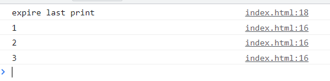
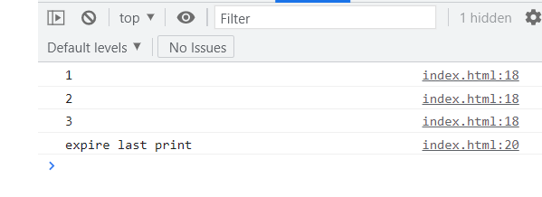

# async

## 1.async函数返回一个Promise

```js
  async function demo() {
      return '夏鸣予'
    }
    console.log(demo()) // Promise {<fulfilled>: '夏鸣予'}
```

## 2.返回的值可以用.then接受

```js
    async function demo() {
      return '夏鸣予'
    }
    demo().then(res => {
      console.log(res) // 夏鸣予
    })
```

我发现这样也可以

```js
    async function demo() {
      return Promise.resolve('夏鸣予')
    }
    demo().then(res => {
      console.log(res) // 夏鸣予
    })
```

## 3.catch错误处理

```js
    async function demo() {
      throw new Error('出错了!')
    }
    demo().catch(res => {
      console.log(res) // Error: 出错了!
    })
```

# await

## 1.await一般用来修饰Promise对象,能直接返回Promise对象的结果

```js
    function sleep(time) {
      return new Promise(reslove => {
        setTimeout(() => {
          reslove('ok')
        }, 1000)
      })
    }
    async function demo() {
      const res = await sleep(1000)
      console.log(res) 
    }
    demo() // 1s后输出ok
```

## 2.await能修饰带有then方法的对象

```js
    const obj = {
      then: (reslove, reject) => {
        reslove('ok')
      }
    }
    async function demo() {
      const res = await obj
      console.log(res) // ok
    }
    demo()
```

这个`obj`对象被视为`Promise`

# await错误处理

一个`async`修饰的函数,如果内部有多个`await`，任何一个`await`修饰的`Promise`状态变为`reject`，后续代码都不会继续执行

```js
    async function demo() {
     await Promise.reject(new Error('fail'))
     await Promise.resolve('ok') // 不会执行
    } 
```

## 解决方案

```js
    async function demo() {
      await Promise.reject(new Error('fail')).catch(err => {
        console.log(err)
      })
      const res = await Promise.resolve('ok') // 会执行
      console.log(res) // ok
    }
    demo()
```

# await注意点

## 1. 处理await可能出现的错误

用`try catch`块去包裹

```js
    async function demo() {
      try {
        await Promise.reject(new Error('fail'))
      } catch (error) {
        console.log(error)  // Error: fail
      }
    }
    demo()
```

## 2.多个不相关的异步操作,让其并行发出

使用`Promise.all`来将多个不相关的网络请求并行发出

## 3.await只能用在async函数里面

## 4.有趣的知识

```js
    const demoArr = [Promise.resolve('1'), Promise.resolve('2'), Promise.resolve('3')]
    demoArr.forEach(async (val) => {
      const res = await val
      console.log(res)
    })
    console.log('expire last print')
```

输出结果



所以避免在`forEach`里面执行异步任务

可以考虑使用`for of`

```js

    async function demo() {
      const demoArr = [Promise.resolve('1'), Promise.resolve('2'), Promise.resolve('3')]
      for (let val of demoArr) {
        const res = await val
        console.log(res)
      }
      console.log('expire last print')

    }
    demo()
```



# 按顺序发送并发请求

如上如示,`foreach`是并发发送所有请求,把数组中的请求按顺序发送可以考虑使用`for of`