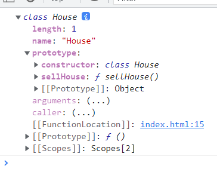

## 前言

终于到了老夫最喜欢的环节,ES6的类。这个学起来就比较有意思了<(￣︶￣)>。

## 什么是类

该部分内容由我的同事JAVA大佬陈兄撰写

## 类的方法

类上面的方法都是在类的原型上的,这里我们打印一下`House`




发现`House === House.prototype.constructor`

## 遍历问题

先上代码

```js
    // 注意类名一般大写
    class House {
      constructor(name) {
        this.name = name
      }
      sellHouse() {
        // 逻辑
      }
    }
    console.log(Object.keys(House.prototype)) // []
```

`House.constructor`是一个对象,但是用`Object.keys`方法遍历不出来属性。说明类里面定义的方法是不可枚举的,要想拿到方法,要调`Object.getOwnPropertyNames`方法

```js
    // 注意类名一般大写
    class House {
      constructor(name) {
        this.name = name
      }
      sellHouse() {
        // 逻辑
      }
    }
    console.log(Object.getOwnPropertyNames(House.prototype)) // (2) ['constructor', 'sellHouse']
```

## 类里面的constructor方法

如果你学过`C++`或者`java`那么你对`new`关键字一定不陌生,在`js`它是用来生成实例对象的,请看代码和相关注释

```js
    // 注意类名一般大写
    class House {
      constructor(name) {
        console.log(`自动调用${name}`) // 自动调用夏鸣予
        this.name = name
      }
      sellHouse() {
        // 逻辑
      }
    }
	// 使用new关键字,自动调用类中的constructor方法,没有constructor方法,js引擎会自动给你的类加上这个方法
    const houseInstance = new House('夏鸣予')
```

## 类的实例

类的实例是共享原型的,也就是

```js
    // 注意类名一般大写
    class House {
      constructor(name) {
        console.log(`自动调用${name}`) // 自动调用夏鸣予
        this.name = name
      }
      sellHouse() {
        // 逻辑
      }
    }
    const house1 = new House('夏鸣予')
    const house2 = new House('玲珑心')
    console.log(house1.prototype === house2.prototype) // true
```

这里我想提一嘴,我以前记得构造函数的对象是有原型(`_proto_`)这一属性了,怎么今天测试打印的时候,`house1`和`house2`直接指向了这个类,好奇怪。

## 好文推荐

这里推荐一篇知乎上面解释原型和原型链很好的一篇文章[说说原型](https://zhuanlan.zhihu.com/p/35790971)。个人感觉通俗易懂。

## 原型对象上添加方法

我尝试用以下的方式给类添加方法但是失败了,打印发现实例已经没有`prototype`和__proto__属性了,我记得以前有的啊。。。这个问题待补充


