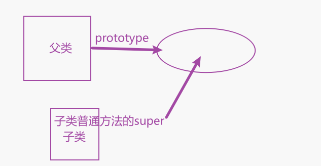
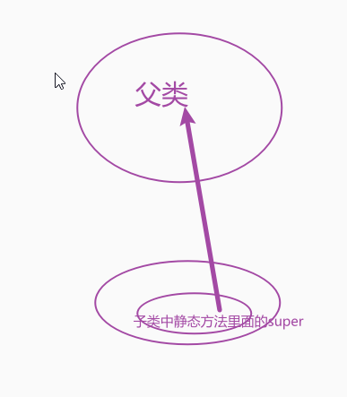

## 简介

本文基于峰哥的`ES6`类的继承一节谈谈我的理解

先写一个`father`类

```js
    class Father {
      constructor(money,carName) {
        this.money = money
        this.carName = carName
      }
    }
```


在`new`一个`Father`实例的时候,我们给他配置一些金钱并配置一辆车,而在`199x-200x`年,你出生了,当然你可以完美继承你爸爸的金钱,你除了继承你爸爸的钱以外,你也可以开你爸爸的车,并且你还可以有你自己的车,所以继承的概念就出来了

```js
    class Father {
      constructor(money,carName) {
        this.money = money
      }
    }
    class Son extends Father {
      constructor () {
      }
    }
```

现在的关键问题就是,怎么把你`new`出来？如果按照正常的思路,我们直接按下面的方式就可以了,但是控制台报错了

```js
    class Father {
      constructor(money, carName) {
        this.money = money
        this.carName = carName
      }
    }
    class Son extends Father {
      constructor() {

      }
    }
    const son = new Son() // Must call super constructor in derived class before accessing 'this' or returning from derived constructor
```

我们得搞清楚一点,是先有你爸爸,再有你,而不是先有你在有你爸爸,也不是你爸爸和你同时出生,那么你存在的前提,你爸爸肯定得先存在,所以必须在子类的构造函数中调用父类的`constructor`方法,其实调用父类的` constructor`主要原因是子类只有调用父类的构造方法,子类才能生成自己的`this`,所以正确的子类构造函数写法就来了。

```js
    class Father {
      constructor(money, fatherCarName) {
        this.money = money
        this.fatherCarName = fatherCarName
      }
    }
    class Son extends Father {
      constructor(money, fatherCarName, sonCarName) {
        // 调用父类构造函数
        super(money, fatherCarName)
        this.sonCarName = sonCarName
      }
    }
    const son = new Son(10000, 'Audi', 'BMW')
    console.log(son.money) // 10000
    console.log(son.fatherCarName) // Audi
    console.log(son.sonCarName) // BMW
```

要注意要先调用父类的构造函数,才能用子类的`this`

## 继承原则

除了私有属性以外,子类能父类的全部方法和属性

```js
    class Father {
      constructor(money, fatherCarName) {
        this.money = money
        this.fatherCarName = fatherCarName
      }
      static fatherName = '夏鸣予'
      demo() {
        console.log('小兔子乖乖')
      }
    }
    class Son extends Father {
      constructor(money, fatherCarName, sonCarName) {
        // 调用父类构造函数
        super(money, fatherCarName)
        this.sonCarName = sonCarName
      }
    }
    const son = new Son(10000, 'Audi', 'BMW')
    console.log(Son.fatherName) // 夏鸣予
    son.demo()
```

其实这个也好理解,你爸爸的东西除了你爸爸的一些私人物品以外,其它的比如车子,房子,车子啥的,你能使用也是很正常的事情

## 获取父类是谁

如果你已经80岁了,你已经有老年痴呆了,你可以选择调用`Object.getPrototypeOf`方法,来知道你爸爸是谁。

```js
      constructor(money, fatherCarName) {
        this.money = money
        this.fatherCarName = fatherCarName
      }
      static fatherName = '夏鸣予'
      demo() {
        console.log('小兔子乖乖')
      }
    }
    class Son extends Father {
      constructor(money, fatherCarName, sonCarName) {
        // 调用父类构造函数
        super(money, fatherCarName)
        this.sonCarName = sonCarName
      }
    }
    console.log(Object.getPrototypeOf(Son) === Father) // true
```

## Super关键字

`super`的中文意思是超级的意思,这个关键字记住跟**父类**有关就行。

`super`有多重人格

* 1.可以化身为函数
* 2.可以化身为对象

### 1.化身为函数

在子类构造函数中使用,调用父类构造函数,并且此时父类构造函数的`this`指向子类实例。

`super`为函数时只能用在子类的构造函数中。

### 2.化身为对象

`super`在子类的普通函数中,指向父类的原型(`prototype`),其实吧就是下图的关系




```js
    class Father {
      constructor(money, fatherCarName) {
        this.money = money
        this.fatherCarName = fatherCarName
      }
      static fatherName = '夏鸣予'
      // 问儿子有钱用没
      hasMoney() {
        console.log('儿子,有生活费吗?')
      }
    }
    class Son extends Father {
      constructor(money, fatherCarName, sonCarName) {
        // 调用父类构造函数
        super(money, fatherCarName)
        this.sonCarName = sonCarName
      }
      // 呼叫老爸
      callFather() {
        super.hasMoney()
      }
    }
    const son = new Son(100000, 'Volkswagen', 'BMW')
    son.callFather() // 儿子,有生活费吗?
```

`super`在子类的静态方法中指向父类




```js
    class Father {
      constructor(money, fatherCarName) {
        this.money = money
        this.fatherCarName = fatherCarName
      }
      static fatherName = '夏鸣予'
      // 问儿子有钱用没
      hasMoney() {
        console.log('儿子,有生活费吗?')
      }
	// 问儿子忙不忙
      static hasBusy() {
        console.log('儿子忙不忙?')
      }
    }
    class Son extends Father {
      constructor(money, fatherCarName, sonCarName) {
        // 调用父类构造函数
        super(money, fatherCarName)
        this.sonCarName = sonCarName
      }
      // 呼叫老爸
      callFather() {
        super.hasMoney()
      }
      static callFather() {
        super.hasBusy()
      }
    }
    Son.callFather() // 儿子忙不忙?
```

### 3.注意点

子类用`super`调用父类方法,此时父类中的`this`是指向子类中的实例。

## 博客

欢迎访问我的博客[www.smartxy.cc](http://www.smartxy.cc/)

## 结束语

还有类的原型,子类的原型,类的混合,技术有限看不懂了已经,若有需要可点此[链接](https://es6.ruanyifeng.com/#docs/class-extends#Object-getPrototypeOf)自行查看峰哥文章。

ES6类的出现,让曾经学过C++的我,似乎得到了重生。写起来太爽了。