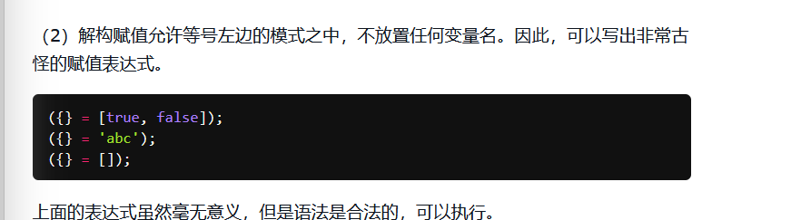

<!-- more -->
## 数组的解构赋值

```js
    const arr = [1, 2, 3]
    const [a, b, c] = arr
    console.log(a) // 1
    console.log(b) // 2
    console.log(c) // 3
```

### 解构不成功

```js
    const arr = [1, 2, 3]
    const [a, b, c, d] = arr
    console.log(a) // 1
    console.log(b) // 2
    console.log(c) // 3
    console.log(d) // undefined
```

### 部分解构

```js
    const arr = [1, 2, 3]
    const [a, b] = arr
    console.log(a) // 1
    console.log(b) // 2
```

### 默认值

解构赋值可以给默认值,也就是说,我能解构出来值,我就优先用解构的值,如果我没解构的值我就看看有没有默认值,如果有默认值我就用默认的值。

```js
    const arr = [1, 2, 3]
    const [a, b, c, d = 4] = [1, 2, 3]
    console.log(a, b, c, d) // 1 2 3 4
```

要注意如果解构`null`的话也是可以的

```js
    const arr = [1, 2, 3]
    const [a, b, c, d = 4] = [1, 2, 3, null]
    console.log(a, b, c, d)  // 1 2 3 null
```

解构`undefined`就可以使用默认值了

```js
    const arr = [1, 2, 3]
    const [a, b, c, d = 4] = [1, 2, 3, undefined]
    console.log(a, b, c, d)
```

## 对象的解构赋值

```js
    const obj = {
      x: 1,
      y: 2
    }
    const { x, y } = obj
    console.log(x, y) // 1 2
```

### 解构赋值重命名

```js
    const obj = {
      x: 1,
      y: 2
    }
    const { x: res, y: res1 } = obj
    // 所以可以得出上面的解构是个简写,实际上是,前面一个是模式,后面一个才是能用的变量
    const { x:x, y:x } = obj
    console.log(res, res1) // 1 2
```

### 解构失败

#### 一层解构失败返回`undefined`

```js
    const obj = {
      x: 1,
      y: 2
    }
    const { z } = obj
    console.log(z) // undefined
```

#### 多层解构失败报错

```js
    const obj = {
      x: 1,
      y: 2
    }
    const { z: { w } } = obj //  Cannot read properties of undefined (reading 'w')
```

#### 解构赋初值

```js
    const { x = 3 } = {}
    console.log(x) // 3
```

`null`也是能够被解构的

```js
    const { x = 3 } = { x: null }
    console.log(x) // null
```


#### 插一嘴

记一个小知识点

```js
undefined == null
true
undefined === null
false
```



看到这里我笑死了

#### 数组的对象式解构赋值

```js
    const arr = [1, 2, 3]
    const { 0: bar, 1: foo } = arr
    console.log(bar, foo) // 1 2
```

## 字符串的解构赋值

```js
    const str = 'hello'
    const [a, b, c, d, e] = str
    console.log(a, b, c, d, e) // h e l l o
```

## 数值和布尔值的解构赋值

个人觉得很冷门,项目中遇到后补充...

## 函数参数的解构赋值

```js
    function add([x, y]) {
      console.log(x, y) // 1,2
    }
    add([1, 2])
```

这个地方我的理解就是隐式解构了。

## 用途

### 交换变量的值

```js
   	let x = 1;
    let y = 2;
    [x, y] = [y, x]
    console.log(x, y)
// 这个地方如果不加分号会报错,暂时还没弄清楚为啥Uncaught ReferenceError: Cannot access 'y' before initialization
```

### 从函数中返回多个值

```js
    const { x, y, z } = (() => {
      return {
        x: 1,
        y: 2,
        z: 3
      }
    })() 
    console.log(x, y, z) // 1 2 3
```

```js
    const [x, y, z] = (() => {
      return [
        1, 2, 3
      ]
    })()
    console.log(x, y, z) // 1 2 3
```

### 函数调用时直接解构

```js
 // 把x,y,z直接解构传进去    
	function demo({ x, y, z }) {
      console.log(x, y, z)  // 1 2 3
    }
    demo({ x: 1, y: 2, z: 3 })
```

## 我在vue项目中的基操

### 解构路由对象中的query和params参数

xx.vue组件中使用

```js
const { params, query } = this.$route
```

### axios网络请求中解构data

```js
// 解构data,重命名为res
const { data: res } = await axios.get('/api')
```

