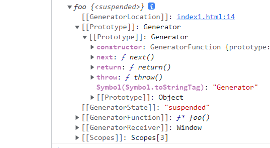

::: tip 

这是一篇关于ES6generator函数的知识o(￣▽￣)ｄ

:::

<!-- more -->

## 前奏

**在学习这篇文章之前,假设我们还没有学过ES7的async和await语法，但是我们学过Promise**

学习一个新的知识,应该带有一些目的性,或者了解一下相关背景,带着疑问去学一个东西,至少不会那么痛苦。(不要跟我说学习是快乐的,学习哪来的快乐(￣ー￣) (￣ー￣))。

我们先看一个场景,一个很常见且简单的需求。现在有2个接口,一个获取token的接口/api/gettoken,一个获取用户信息的接口/api/getuserinfo,那么帅气的后端小哥哥给我们进行了定义,在我们获取用户信息之前,必须先拿到token,所以,我们前端在获取用户信息时的处理代码就应该是这样的

```js
    getUserInfo () {
      axios.get('/api/gettoken').then(res => {
        const { token } = res
        return token
      }).then (token => {
        axios.get('/api/getuserinfo', { params: { userid: '' } }).then (res => {
          const { userinfo } = res
          // 用用户信息干别的事情
        })
      })
    }
```

这种场景在真实业务是很常见的一种事情,各位想想,如果后端让你再用用户信息去干别的事情呢,比如根据用户信息中的某些参数再去获得一些其他的东西,这么一弄,问题就来了, 我们就得一直.then.then,虽然**Promise**帮我们解决了很大问题,已经处理了以前ajax回调地狱的问题,但是.then的方式过多,代码的优雅性就变的很低了。有没有更好的处理方式呢?**这里要先说一下,目前最好的处理网络请求的方式是async和await**但是这篇文章只讲generator。


## 主题

### 主角

带着前奏的问题,我们来介绍一下我们这篇文章的主角**Generator函数**。

废话不多说,先上代码(talk is cheap，show you my code):

```js
    // Generator函数学习 
    function* foo() {
      const y = yield 9
      console.log(111111)
      return y
    }
    const aRes = foo()
    /*     aRes你可以理解为一个指针,这个如果学过算法与数据结构就很好理解了
        你可以理解为调用这个generator函数它不会执行里面的代码,而是返给你一个指针 */
    /*   然后指针上面有个next()方法,调用之后,指针就会指到第一个yield这里,再次调用它就会
      指向第二个yield,如果没有返回结果的对象里面,done的属性就为true */
    console.log(aRes)
    console.log(aRes.next())
    console.log(aRes.next(3))
    // console.log(aRes.next(5))
```

分析: 函数后面带*号表示这是一个generator函数,就跟vue里面的很多对象自带$符号一样,为了跟普通的自定义对象做区分。

然后在generator中我们可以使用一个很关键的标识符**yield**。

然后再来分析上面的函数

我们先在控制台打印一下aRes,输出的是以下结果。



我们发现函数的运行结果是一个对象,然后原型上有个next方法,我们重点关注这个方法。**我们来把这个方法调用一下,看看会怎么样**

控制台打印console.log(aRes.next())

输出结果:

```js
{
    done: false
	value: 9
}
```

看到这里,其实就对**generator**函数有了初步的认识了,我们在看**generator**函数时,大脑里面最好给函数语句前面想象一个指针,当调用**next()**方法时,你大脑里面想的那个指针就会指到**yield**这个标识符那条语句前面,而**yield**语句可以看做**return**,它跟**return**语句的区别在于,

执行**return**语句后,函数体就结束了,后面的语句就不执行了,但是指针指到**yield**这条语句的时候,函数会暂停执行,通俗的理解就是卡在这里了,处于等待状态,这时候`value = 9`就是yield后面的值,而`done = flase`表示指针还没有指到结尾的节点,说的通俗点,如果在指到一个yield之后,再调用一次aRes.next()方法,后面没有yield了,done就会变成true,这里我理解为函数执行完毕了。

### next函数传参


