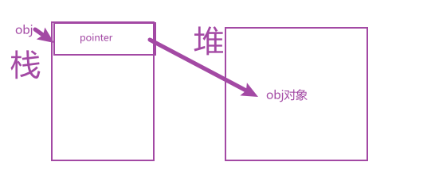

## let

除了`var`现在可以使用`let`声明变量了

### let声明的变量存在块级作用域

```js
    {
      let a = 1
      var b = 2
    }
    console.log(a) //  ReferenceError: a is not defined
    console.log(b) // 上面报错这行代码没有运行,正常是可以打印2的
```

块与块之间是相互不影响的,如果下面的n用var定义,那么n就是3了

```js
   (() => {
      let n = 5
      if (true) {
        let n = 3
      }
      console.log(n) // 5
    })();
```


### 不允许重复声明变量

```js
   let i = 0
   let i = 1 // Uncaught SyntaxError: Identifier 'i' has already been declared
```

### for循环与let

#### for循环体内部是一个子作用域

```js
    for (let i = 0; i < 2; ++i) {
      let i = 'a'
      console.log(i) // a被打印了2次,因为同一作用域变量不能被重复声明,所以循环体内部i是不一样的
    }
```

### 不存在变量提升

```js
    console.log(foo) // undefined
    var foo = 'a'
    console.log(bar) //  Uncaught ReferenceError: Cannot access 'bar' before initialization
    let bar = 'b'
```

用`let`声明的变量,只能先定义后使用,var定义的变量,脚本运行时就存在了。看来`js`当初的确设计的很随意呀,哈哈哈。当初学`java`的时候,还记得变量要声明类型,压根就没想过变量还能先使用后声明。

### 暂存性死区

一句话总结: 用`let`和`const`声明的变量,一定要记得先定义,后使用,不然就会报错。

### 有趣的知识

```js
    var foo = 'a';
    (() => {
      console.log(foo)
      if (false) {
        var foo = 'b'
      }
    })();
```

控制台打印的是`undefined`，我的个人理解是,虽然if语句没有执行,但是在脚本运行时,if语句内部的`var foo`是运行了的,也就是foo这个变量它存在,并且覆盖了外层的,只是没有赋值。没有赋值,代表程序没有走进去吗。

### 杂项

* 尽量避免在块级作用域中声明函数
* 块级作用域必须要有大括号
* 要记住先声明后使用

## const

`const`一般是用来声明常量的,也就是说这个变量一旦声明,值就不能改变。对象和数组,函数除外,因为对象和数组还有函数属于引用数据类型。比如我定义一个对象obj, `const obj = {}`，上图。obj实际上存的是一个指针,指向obj这个对象在堆中的位置。所以对obj添加和删除属性是ok的,但是如果你`obj = {}`,就会报错了,因为你修改了pointer指针的指向。



```js
    const a = 1
    console.log(++a) // Uncaught TypeError: Assignment to constant variable.
```

同`let`有暂存性死区,块级作用域,变量也是要先定义,后使用。

## 顶层对象

上代码

```js
    var a = 1
    console.log(window.a) // 1
    let b = 2
    console.log(window.b) // undefined
```

在浏览器环境,顶层对象指的是window,在node中指的是global。顶层对象的赋值与全局变量的赋值是一回事。