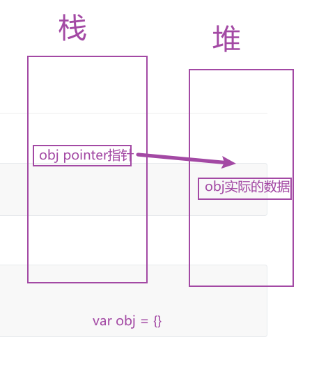

## 变量提升(hoisting)

`js`引擎解析代码的方式是先把所有被声明的变量放在头部,所以会出现以下情况

```js
    console.log(a) // undefined
    var a = 1
```

## 标识符

可以使用中文名字作为标识符,标识符就是你给你的变量起的名字

```js
    // 合法
  var 夏鸣予 = '哎呀呀'
```

这里我的理解就是对象不是由`key`和`value`组成的吗,key就是字符串,你写中文,其实我认为`js`被解析的时候自动帮你转为字符串了。

## 区块

用大括号把一组语句括起来,被称为区块。

`var `声明的变量不存在块级作用域,`let`，`const`存在

## 数据类型

这个地方有的文章写`js`有基本数据类型和复杂数据类型,有的地方写原始类型和合成类型,搞不清楚了。我是这样记的。

有`String,Number,NULL,Undefined,Boolean,Symbol,Object,Array,Function`这些类型,注意函数也是一种数据类型,所以函数可以作为参数传给别的函数。

## typeof 运算符

`typeof`运算符判断你定义的变量是什么数据类型,得注意以下几点。

* `typeof`数组,是一个对象(`object`)
* `typeof null`，也是一个对象(`object`)

## 谈谈我对null和undefined的理解

参考文章: [阮一峰的网络日志](https://www.ruanyifeng.com/blog/2014/03/undefined-vs-null.html)

* 二者的数据类型是不一样的一个是`Object`一是`undefined`
* `null`可以作为原型链的终点
* `undefined`可以理解为你有这个变量,或者函数要这个参数,但是你不给它赋值或者传值

## 布尔值

这里注意一点

在用`if`判断空数组或者空对象时,是能进入代码块的,所以我判断空数组一般用数组的`length`属性,判断对象是不是空我一般`Object.keys('你的对象').length!==0`

## 数值范围

`js`能够表示的整数范围: 大于等于2的1024次方,返回`Infinity`,小于等于2的-1075次方返回0

## NAN

`NaN`中文翻译过来就是**不是一个数字**,比如在进行逻辑运算的时候5- `x`,结果就是`NaN`,

**工作总结**: 有时候会出现让输入框只能让用户输入数字,这时候在`input`的`change`事件就可以做这种判断(`num`为用户输入的值)

```js
    // 输入框change事件
    handleSkuNumChange () {
        // 判断用户输入的值是不是数字,不是数字或者用户输入的值小于1,就置1
      if (isNaN(num) || num < 1) {
        num = 1
      } else {
          // 如果是物品的数量,那肯定就要置1了
        num = parseInt(num)
      }
    },
```

`NaN是Numer`类型

## IsNaN方法

`isNaN`用来判断一个数据是否是整数，

记一个知识点: **对于空数组和数组中只有一个值的变量**,`isNaN`返回的是`false`

示例: 

* `isNaN([])// false` 
* `isNaN([1]) // flase`

# 字符串

* 字符串用单引号或者双引号起来

* 良好的编程风格: `js`代码中`字符串`应用单引号包起来。

* 在单引号中使用单引号,在双引号中使用双引号要用转义字符`"\""`，`'\''`

## 字符串与数组

* 字符串可以按照数组的方式取值

```js
    const str = 'hello'
    console.log(str[0]) // h
```

* 但是字符串不能像数组那样修改值

  ```js
      const str = 'hello'
      str[0] = 'w'
      console.log(str) // hello
  ```

  

### length属性

`length`属性返回字符串的长度,但是与数组不同的是字符串的`length`属性是无法手动改变的

## 对象

首先搞清楚一个点对象是引用类型



定义一个对象`obj`实际上在栈内存存的是对象的地址,可以理解为指针,指针是指向堆内存实际的数据的。所以说会出现下面的情况

```js
    const obj = {
      x: 1
    }
    const bar = obj
    obj.x = 2
    console.log(bar.x) // 2
```

### 取值

对象里面的数据格式是`key`: `value`的形式,当我把`key`取中文的时候,我就明白了,`js`是能自动帮我把`key`转为字符串的,但是如果你的`key`值不符合命名规则,比如第一个字符是运算符或者数字,那么你的`key`值必须加上引号。

取对象里面的值有2种方式

* `obj.foo`这时候`foo`是个字符串
* `obj[foo]`,这时候`foo`是个变量,比如`foo='bar'`，那么`obj[foo]`实际上是`obj.bar`

### in操作符

`in`操作符判断这个属性(`key`)是不是属于这个对象 `in`的左边是`key`值,右边是这个对象。

注意一点: **继承的属性用in操作符也是有效的**

示例: 

```js
    const obj = {}
    console.log('toString' in obj) // true
```

## delete操作符

`delete`操作符用户删除对象中的某个属性,删除成功返回`true`，但是有个问题是,对象里面没这个属性你删除,也返回`true`,也就是不能通过`delete`操作符返回的结果,来判断这个对象中有没有这个`key`值

### for in

`for in`用来遍历对象

示例:

```js
    const obj = {
      x: 1,
      y: 2
    }
    for (key in obj) {
      console.log(key)
    }
```

`for in`对于继承的属性也是能够遍历出来的,出`bug`时需要注意。可以考虑用`hasOwnProperty`判断这个`key`是不是本身的

```js
    const obj = {
      x: 1,
      y: 2
    }
    // 获取obj对象的原型并添加一个a属性
    Object.getPrototypeOf(obj).a = 1
    for (key in obj) {
      console.log(key)
    }
```

 

