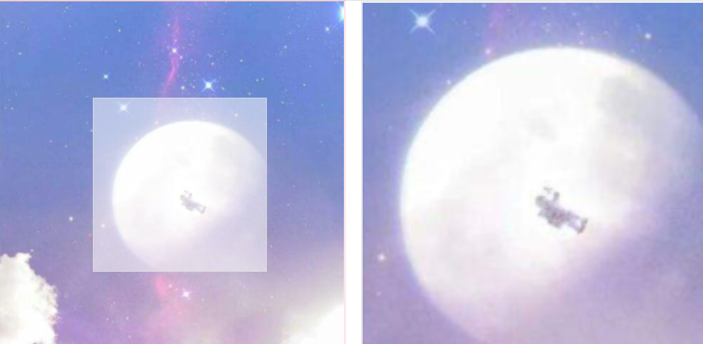
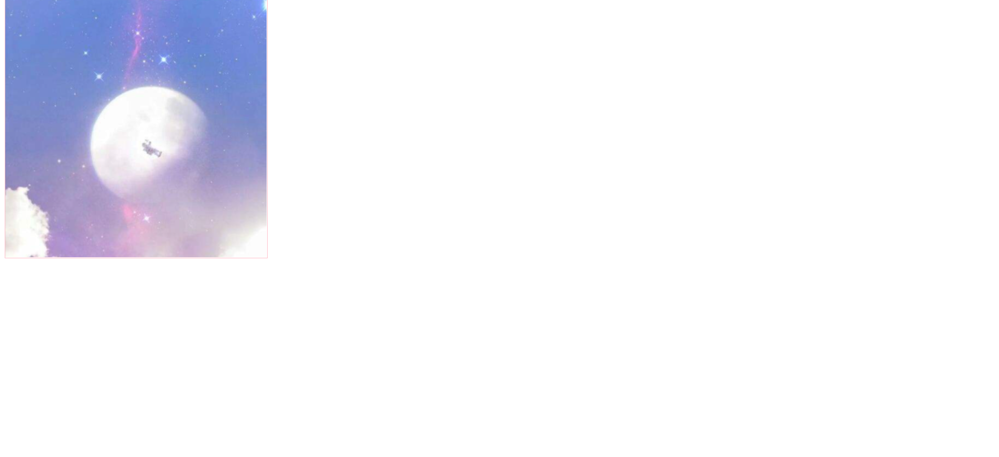
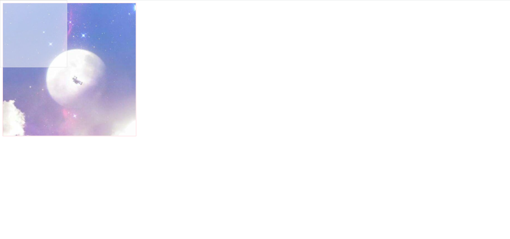
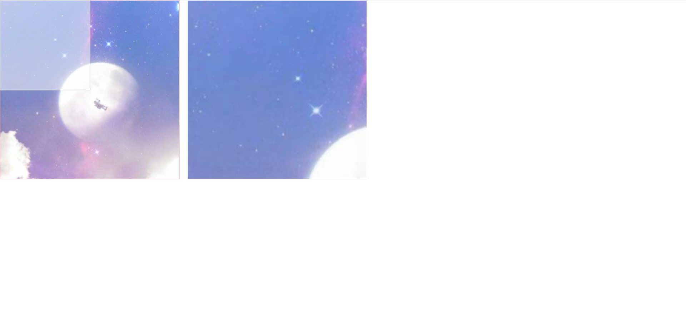
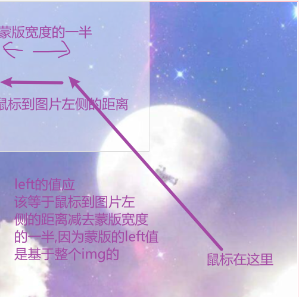
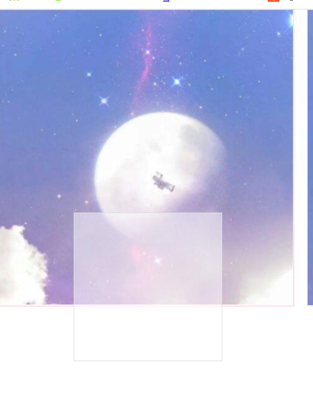

记录一次原生js实现放大镜效果。

## 效果图



## 设计思路

### 基本架子

先弄一个容器放正常的图片,中间那个蒙版(稍微有点透明的白色正方形),肯定给绝对定位,动态调`left`，`top`值,

所以子绝父相,父容器给相对定位。

```html
<!DOCTYPE html>
<html lang="en">

<head>
  <meta charset="UTF-8">
  <meta http-equiv="X-UA-Compatible" content="IE=edge">
  <meta name="viewport" content="width=device-width, initial-scale=1.0">
  <title>Document</title>
  <style>
    .zoom-info {
      width: 400px;
      height: 400px;
      border: 1px solid pink;
    }

    .zoom-info .zoom img {
      width: 100%;
      height: 100%;
      position: relative;
    }
  </style>
</head>

<body>
  <div class="zoom-info">
    
  </div>
</body>

</html>
```

视图:



### 蒙版

在弄个正方形蒙版出来,这个正方形蒙版,就是说,你鼠标移动到这个图片里面时,正方形的蒙版的中心肯定是跟随你的鼠标移动的。就是你想放大的那个区域。

```html
<!DOCTYPE html>
<html lang="en">

<head>
  <meta charset="UTF-8">
  <meta http-equiv="X-UA-Compatible" content="IE=edge">
  <meta name="viewport" content="width=device-width, initial-scale=1.0">
  <title>Document</title>
  <style>
    .zoom-info {
      width: 400px;
      height: 400px;
      border: 1px solid pink;
    }

    .zoom-info img {
      width: 100%;
      height: 100%;
      position: relative;
    }

    /* 新增 */
    .zoom-info .mask {
      width: 200px;
      height: 200px;
      background: rgba(255, 255, 255, 0.5);
      position: absolute;
      border: 1px solid #ddd;
      left: 0;
      top: 0;
    }
  </style>
</head>

<body>
  <div class="zoom-info">
     <div class="zoom">
       
      </div>
    <!-- 新增 -->
    <div class="mask"></div>
  </div>
</body>

</html>
```


视图:



### 放大效果图

放大效果图跟原来的图片是一样的,有一个地方不同的是放大效果图的宽高相对于原图是大了一倍,然后父盒子还是跟左边图片一样的宽度,溢出隐藏这样图片放大效果就有了。

```html
<!DOCTYPE html>
<html lang="en">

<head>
  <meta charset="UTF-8">
  <meta http-equiv="X-UA-Compatible" content="IE=edge">
  <meta name="viewport" content="width=device-width, initial-scale=1.0">
  <title>Document</title>
  <style>
    * {
      margin: 0;
      padding: 0;
    }

    .zoom-info {
      width: 400px;
      height: 400px;
      border: 1px solid pink;
    }

    .zoom-info .zoom img {
      width: 100%;
      height: 100%;
      position: relative;
    }

    .zoom-info .mask {
      width: 200px;
      height: 200px;
      background: rgba(255, 255, 255, 0.5);
      position: absolute;
      border: 1px solid #ddd;
      left: 0;
      top: 0;
    }

    /* 新增 */
    .zoom-info .big-img {
      width: 400px;
      height: 400px;
      position: absolute;
      border: 1px solid #ddd;
      left: 420px;
      top: 0;
      overflow: hidden;
    }

    /* 新增 */
    .zoom-info .big-img img {
      width: 800px;
      height: 800px;
    }
  </style>
</head>

<body>
  <div class="zoom-info">
      <div class="zoom">
       
      </div>
    <div class="mask"></div>
    <!-- 新增 -->
    <div class="big-img">
      
    </div>
  </div>
</body>

</html>
```

视图:



## 逻辑设计

### 蒙版跟放大的图肯定要先隐藏

这里给相关的类名加一个`display:none`属性就行了

### 鼠标移入图片显示蒙版

给图片加一个`mousemove`事件,鼠标移入调整`display: block`就行了

上脚本代码

```js
  <script>
    window.addEventListener('load', () => {
      // 原始图片 .zoom div
      const originDom = document.querySelector('.zoom')
      console.log(originDom)
      // 正方形蒙版
      const maskDom = document.querySelector('.mask')
      // 大图
      const bigImgDom = document.querySelector('.big-img')
      originDom.addEventListener('mousemove', () => {
        maskDom.style.display = 'block'
        bigImgDom.style.display = 'block'
      })
    })
  </script>
```

亲测没问题,不贴视图了

### 鼠标移动蒙版跟着移动

鼠标移动的时候,正方形蒙版肯定也要跟着移动,因为蒙版的中心位置肯定是鼠标,上这部分的处理逻辑,这个地方要说明一个东西,就是鼠标移动的时候,肯定要动态改变蒙版的`left`，`top`值,怎么改呢？看示意图



注意这个地方不理解好,你后面的东西做不了,这个地方理解了你就没啥大问题了对于放大镜。

写到这里,有一件非常重要的事情,这时候你要回头给一个地方添加css属性,就是给蒙版加一个` pointer-events: none;`，为什么呢,请参考一下这篇[文章](https://blog.csdn.net/weixin_40594645/article/details/107285015?utm_medium=distribute.pc_relevant.none-task-blog-2~default~baidujs_title~default-0.queryctrv4&spm=1001.2101.3001.4242.1&utm_relevant_index=2)，当前你也可以选择不加,后面看看会出什么样的bug再解决也不迟。

```js
  <script>
    window.addEventListener('load', () => {
      // 原始图片 .zoom div
      const originDom = document.querySelector('.zoom')
      console.log(originDom)
      // 正方形蒙版
      const maskDom = document.querySelector('.mask')
      // 大图
      const bigImgDom = document.querySelector('.big-img')
      originDom.addEventListener('mousemove', (e) => {
        maskDom.style.display = 'block'
        bigImgDom.style.display = 'block'
        // 获取鼠标到图片左侧,上侧的位移
        const { offsetX, offsetY } = e
        // 获取蒙版的宽
        const maskWidth = maskDom.offsetWidth
        // 获取蒙版的高
        const maskHeight = maskDom.offsetHeight
        // 计算left的值
        let left = offsetX - maskWidth / 2
        // 计算top的值
        let top = offsetY - maskHeight / 2
        // 赋值
        maskDom.style.left = `${left}px`
        maskDom.style.top = `${top}px`
      })
    })
  </script>
```

这样鼠标移动的时候蒙版也会跟着移动了

## 处理边界情况

这个时候会有这么一个问题,就是蒙版会超出img容器,示例



所以要处理边界情况:

```js
        // 处理左边和顶部溢出
        if (left < 0) {
          left = 0
        }
        if (top < 0) {
          top = 0
        }
        // 处理右边和下边溢出,left + 蒙版的宽不能大于整个图片容器宽
        if ((left + maskWidth) >= originDom.offsetWidth) {
          left = originDom.offsetWidth - maskWidth
        }
        // top + 蒙版的高不能大于整个图片容器高
        if ((top + maskHeight) >= originDom.offsetHeight) {
          top = originDom.offsetHeight - maskHeight
        }
```

## 大图移动

这里注意一点,你想想看,鼠标向左移动,实际上大图要跟着向右移动,为啥呢？因为大图向右移动,我们才能看到大图左边的东西呀,哈哈哈,

这个地方要搞清楚,不然会一脸懵逼，而且还有一点要注意的是你要移动的是图片,而不是大图外层的div,因为外层`div`是溢出隐藏的,**注意,注意,注意**记得回头给大图`img`标签一个绝对定位的属性,不然你的left,top是不生效的。还有一个要注意的地方就是大图移动的距离你可以根据比例来计算。上代码。

```js
        // 比例为大图在父div容器可以移动的距离除以蒙版在小图可以移动的距离
        const ratio = (bigImg.offsetWidth - bigImgDom.offsetWidth) / (originDom.offsetWidth - maskWidth)
        const bigImgLeft = left * ratio
        const bigImgTop = top * ratio
        // 大图移动
        bigImg.style.left = `-${bigImgLeft}px`
        bigImg.style.top = `-${bigImgTop}px`
```


## 小优化

代码写到这里,放大镜基本上已经完成了,我们来做一些小优化,鼠标移除原始图片的时候,肯定要,把正方形蒙版和大图隐藏,所以上代码

```js
    // 监听鼠标移除事件    
originDom.addEventListener('mouseleave', () => {
        maskDom.style.display = 'none'
        bigImgDom.style.display = 'none'
      })
```

然后我们给鼠标移入原始图片加一个小手手的样式,更好看一点

```css
    .zoom-info {
      width: 400px;
      height: 400px;
      border: 1px solid pink;
      cursor: pointer;
    }
```

## 终版

```js
<!DOCTYPE html>
<html lang="en">

<head>
  <meta charset="UTF-8">
  <meta http-equiv="X-UA-Compatible" content="IE=edge">
  <meta name="viewport" content="width=device-width, initial-scale=1.0">
  <title>原生js实现放大镜效果</title>
  <style>
    * {
      margin: 0;
      padding: 0;
    }

    .zoom-info {
      width: 400px;
      height: 400px;
      border: 1px solid pink;
      position: relative;
    }

    .zoom-info .zoom {
      width: 400px;
      height: 400px;
      cursor: pointer;
      position: relative;
    }

    .zoom-info .zoom img {
      width: 100%;
      height: 100%;
      position: relative;
      vertical-align: top;
    }

    .zoom-info .mask {
      width: 200px;
      height: 200px;
      background: rgba(255, 255, 255, 0.5);
      position: absolute;
      left: 0;
      top: 0;
      display: none;
      pointer-events: none;

    }

    .zoom-info .big-img {
      width: 400px;
      height: 400px;
      position: absolute;
      border: 1px solid #ddd;
      left: 420px;
      top: 0;
      overflow: hidden;
      display: none;
    }

    .zoom-info .big-img img {
      width: 800px;
      height: 800px;
      position: absolute;
    }
  </style>
</head>

<body>
  <div class="zoom-info">
    <div class="zoom">
      
    </div>
    <div class="mask"></div>
    <div class="big-img">
      
    </div>
  </div>
  <script>
    let originDom, maskDom, bigImg = null
    window.addEventListener('load', () => {
      // 原始图片 .zoom div
      originDom = document.querySelector('.zoom')

      // 正方形蒙版
      maskDom = document.querySelector('.mask')
      // 大图div
      bigImgDom = document.querySelector('.big-img')
      // 大图图片img标签
      bigImg = document.querySelector('.big')
      handleMouseMove()
      handleMouseLeave()
    })
    // 处理鼠标移动
    function handleMouseMove() {
      originDom.addEventListener('mousemove', (e) => {
        maskDom.style.display = 'block'
        bigImgDom.style.display = 'block'

        // 获取鼠标到图片左侧,上侧的位移
        const {
          offsetX,
          offsetY
        } = e
        // 获取蒙版的宽
        const maskWidth = maskDom.offsetWidth
        // 获取蒙版的高
        const maskHeight = maskDom.offsetHeight
        // 计算left的值

        let left = offsetX - maskWidth / 2
        // 计算top的值
        let top = offsetY - maskHeight / 2
        // 处理左边和顶部溢出
        if (left < 0) {
          left = 0
        }
        if (top < 0) {
          top = 0
        }
        // 处理右边和下边溢出,left + 蒙版的宽不能大于整个图片容器宽
        if ((left + maskWidth) >= originDom.offsetWidth) {
          left = originDom.offsetWidth - maskWidth
        }
        // top + 蒙版的高不能大于整个图片容器高
        if ((top + maskHeight) >= originDom.offsetHeight) {
          top = originDom.offsetHeight - maskHeight
        }
        // 赋值
        maskDom.style.left = `${left}px`
        maskDom.style.top = `${top}px`
        // 比例为大图在父div容器可以移动的距离除以蒙版在小图可以移动的距离
        const ratio = (bigImg.offsetWidth - bigImgDom.offsetWidth) / (originDom.offsetWidth - maskWidth)
        const bigImgLeft = left * ratio
        const bigImgTop = top * ratio
        // 大图移动
        bigImg.style.left = `-${bigImgLeft}px`
        bigImg.style.top = `-${bigImgTop}px`
      })
    }
    // 处理鼠标离开
    function handleMouseLeave() {
      originDom.addEventListener('mouseleave', () => {
        maskDom.style.display = 'none'
        bigImgDom.style.display = 'none'
        // 解绑事件
        originDom.onmousemove = null
        originDom.obmouseleave = null
      })
    }
  </script>
</body>

</html>
```

**注意注意注意**直接复制粘贴该`html`代码是运行不了的,因为图片你是没有的哈,记得自己弄2张图片！！！。


