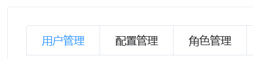
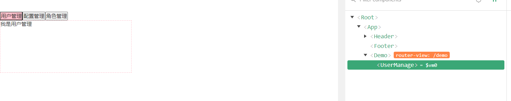
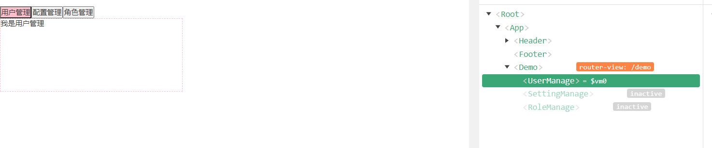

---

title: 让我的Vue得到重生(四)-Vue的动态组件
date: 2022-01-22
tags:
 - Vue
categories:
 - Vue
---

::: tip 

这是一篇关于在Vue项目使用动态组件的文章o(**￣︶￣**)o

:::

<!-- more -->

## 前奏

学习一个新的知识,应该带有一些目的性,或者了解一下相关背景,带着疑问去学一个东西,至少不会那么痛苦。(不要跟我说学习是快乐的,学习哪来的快乐(￣ー￣) (￣ー￣))。

先来看一个场景



点击用户管理,显示用户管理的内容,点击配置管理,显示配置管理的内容,点击角色管理,显示角色管理的内容。

排除我们学过`vue`的动态组件,我们可以这样实现

```vue
<template>
  <div class='demo'>
    <!-- 用户管理 -->
    <UserManage v-if="currentIndex === 1"></UserManage>
    <!-- 配置管理 -->
    <SettingManage v-else-if="currentIndex === 2"></SettingManage>
    <!-- 角色管理 -->
    <RoleManage v-else></RoleManage>
</template>

<script>
  import UserManage from 'components/UserManage'
  import SettingManage from 'components/SettingManage'
  import RoleManage from 'components/RoleManage'
  export default {
    name: 'Demo',
    data() {
      return {
        currentIndex: 0
      }
    },
    components: {
      UserManage,
      SettingManage,
      RoleManage
    }
  }
</script>

<style scoped lang='less'>

</style>

```


配合index和v-if动态显示三个模块的内容。如果组件比较多的话,那么模板里面要写的组件标签页会变多,而且会用到大量的v-if-else,并且如果部分组件需要父组件的值相同时,就会有很多重复性的操作。有没有更好的写法吗？带这个这个问题继续往下看。

## 主题

先上代码在解释

talk is cheap,show you my code

```vue
<template>
  <div class="demo">
    <div class="btn-area">
      <button
        :class="{ current: currentIndex === index }"
        v-for="(item, index) in tabsList"
        :key="index"
        @click="changeCurrentComponent(index, item.componentName)"
      >
        {{ item.name }}
      </button>
    </div>
    <div class="content">
      <component :is="currentView"></component>
    </div>
  </div>
</template>

<script>
import UserManage from 'components/UserManage'
import SettingManage from 'components/SettingManage'
import RoleManage from 'components/RoleManage'
export default {
  name: 'Demo',
  data () {
    return {
      currentView: 'UserManage',
      currentIndex: -1,
      tabsList: [
        {
          name: '用户管理',
          componentName: 'UserManage'
        },
        {
          name: '配置管理',
          componentName: 'SettingManage'
        },
        {
          name: '角色管理',
          componentName: 'RoleManage'
        }
      ]
    }
  },
  components: {
    UserManage,
    SettingManage,
    RoleManage
  },
  methods: {
    changeCurrentComponent (index, view) {
      this.currentIndex = index
      this.currentView = view
    }
  }
}
</script>

<style scoped lang="less">
.demo {
  .btn-area {
    .current {
      background: pink;
    }
  }
  .content {
    width: 300px;
    height: 120px;
    border: 1px dashed pink;
  }
}
</style>

```

调试工具图片




### 解释

从代码不难看出,`currentView`的值是什么,component这个组件会被渲染成相同名称的组件,说的通俗点,我现在点用户管理,那么`component`就会被渲染成`UserManage`组件,点配置管理`component`就会被渲染成`SettingManage`组件,点角色管理`component`就会被渲染成`RoleManage`组件。使用和理解起来并不算很难

## 使用keep-alive组件缓存部分动态组件

有时候会出现这么一个场景,比如用户管理模块有很多个用户,从配置管理切到用户管理时,我们并不想让用户管理这个模块重新渲染,而是回到用户之前操作的地方,这个时候就到用到**keep-alive**组件来进行缓存了。

话不多说上模板区域代码

```html
<template>
  <div class="demo">
    <div class="btn-area">
      <button
        :class="{ current: currentIndex === index }"
        v-for="(item, index) in tabsList"
        :key="index"
        @click="changeCurrentComponent(index, item.componentName)"
      >
        {{ item.name }}
      </button>
    </div>
    <div class="content">
        <!-- 加一个keep-alive组件进行包裹 -->
      <keep-alive>
        <component :is="currentView"></component>
      </keep-alive>
    </div>
  </div>
</template>
```


从调试工具可以看出,当进行3个tabs栏切换后,配置角色和角色管理组件的颜色是灰色的,而且有一个inactive标识,就是未激活状态,这个时候其他2个组件都被缓存了,也就是说从用户管理再切到配置管理,组件不会被重新渲染,生命周期钩子也不会再次触发,但是这个时候组件会有2个特殊的钩子,分别为**activated**和**deactivated**钩子,分别在组件被激活和组件被缓存时调用,说的通俗点,本来正常你调后端接口是在`created`钩子,但是现在组件被缓存了,你要想进入再调接口,就得去`activated`钩子了



## 动态组件传参

动态组件传参和普通的父子组件传参类似,你在动态组件上传给子组件的参数,需要接受的子组件,用props接收一下就行了,不需要接收这个参数的子组件,你就不用管它。

## 小细节

#### 1.使用include来使部分组件缓存

可能会出现这样的场景,我们只需要用户管理这个模块进行缓存,其他的组件不需要缓存,那么我们只需要按如下的方式写就行了,注意还有一种正则写法,正则写法我基本上不用,如需了解请自行查阅资料。等我项目中遇到时,我会更新文档的。

```html
    <keep-alive include="UserManage">
        <component :is="currentView"></component>
      </keep-alive>
```

这时候可能有小伙伴就会问了,唉唉那我要缓存2个组件怎么办呢,如下所示,把要缓存的组件按照下面所示用数组抱起来就行了,因为我们要传一个数组进行,所以别忘了前面的`:`语法糖

```html
      <keep-alive :include="['UserManage', 'SettingManage']">
        <component :is="currentView"></component>
      </keep-alive>
```

#### 2.使用exclude来使个别组件不缓存

还有可能会出现这样的场景,除了**用户管理**这个模块,其他的模块我都要缓存。其实吧,把上面的`include`改成`exclude`就行了,使用方法就是一样的。


## 哲学时刻

人这一辈子要遇见太多人了，我现在相信有些人只是上天派来陪我们走一段路的，路程结束，任务完成，人家也要撤了，所以不必伤感，记住过往美好，迎接新的故事！

