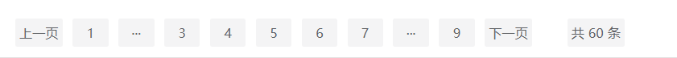
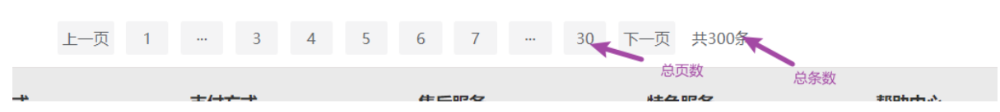
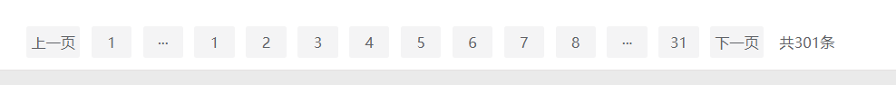
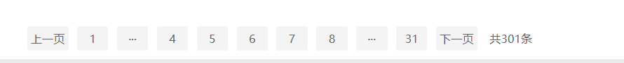
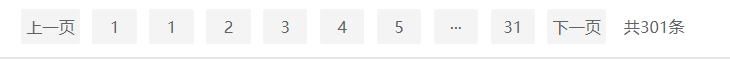
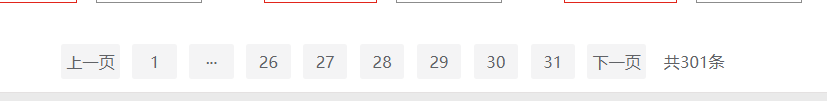
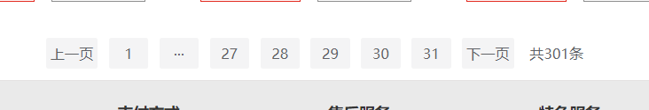

## 主题

数据量过大的时候,前端分页是避免不了的事情,记录一次手写分页器组件(估计我这辈子只会手写这一次)。

首先把静态分页器弄出来。再做js逻辑设计。

```vue
<template>
  <div class="pagination">
    <button>上一页</button>
    <button>1</button>
    <button>···</button>

    <button>3</button>
    <button>4</button>
    <button>5</button>
    <button>6</button>
    <button>7</button>

    <button>···</button>
    <button>9</button>
    <button>下一页</button>

    <button style="margin-left: 30px">共 60 条</button>
  </div>
</template>

<script>
export default {
  name: 'Pagination'
}
</script>

<style lang="less" scoped>
.pagination {
  text-align: center;
  button {
    margin: 0 5px;
    background-color: #f4f4f5;
    color: #606266;
    outline: none;
    border-radius: 2px;
    padding: 0 4px;
    vertical-align: top;
    display: inline-block;
    font-size: 13px;
    min-width: 35.5px;
    height: 28px;
    line-height: 28px;
    cursor: pointer;
    box-sizing: border-box;
    text-align: center;
    border: 0;

    &[disabled] {
      color: #c0c4cc;
      cursor: not-allowed;
    }

    &.active {
      cursor: not-allowed;
      background-color: #409eff;
      color: #fff;
    }
  }
}
</style>

```

视图:



## 参数设计

先要搞清楚几件事情,前端做分页我们需要什么东西？这里假设我们做的是一个商城项目。

* 1.`total`:商品的总数量
* 2.`pageSize`: 每页需要显示的数量
* 3.`curPage`:当前页

然后我设计的分页器,中间那一坨,默认显示5个,也就是当前页前后还带有2个页码

搞清楚我们要的东西之后,我们在父组件传入一些写死的参数测试。

父组件使用

```vue
 <Pagination :total="30" :curPage="6" :pageSize="10"></Pagination>
```

子组件接受

```js
  props: {
    // 商品总数量
    total: {
      type: Number,
      default: 0
    },
    // 当前页
    curPage: {
      type: Number,
      default: 1
    },
    // 每页大小
    pageSize: {
      type: Number,
      default: 10
    }
  }
```

这时候问题就来了,有多少页呢？我们先来推算一下,如果`total`为90,每页的商品数量有10个,那么页码就有9个,但是如果`total`是91呢？那么页码就应该有10个,很明显,是**总数除以每页数量**并向上取了整。所以我们就可以在分页器组件来一个`pageTotalNum`,由于它是依赖于`total`和`pageSize`的,所以我们这里可以把它放到计算属性里面。

```js
  computed: {
      // 页码总数
    pageTotalNum () {
      return Math.ceil(this.total / this.pageSize)
    }
  }
```

写到这里, 我们来测试一下

父组件传参

```html
 <Pagination :total="300" :curPage="6" :pageSize="10"></Pagination>
```


上组件代码

```vue
<template>
  <div class="pagination">
    <button>上一页</button>
    <button>1</button>
    <button>···</button>

    <button>3</button>
    <button>4</button>
    <button>5</button>
    <button>6</button>
    <button>7</button>

    <button>···</button>
    <button>{{ pageTotalNum }}</button>
    <button>下一页</button>

    <span>共{{ total }}条</span>
  </div>
</template>

<script>
export default {
  name: 'Pagination',
  props: {
    // 商品总数量
    total: {
      type: Number,
      default: 0
    },
    // 当前页
    curPage: {
      type: Number,
      default: 1
    },
    // 每页大小
    pageSize: {
      type: Number,
      default: 10
    }
  },
  computed: {
    pageTotalNum () {
      return Math.ceil(this.total / this.pageSize)
    }
  }
}
</script>

<style lang="less" scoped>
.pagination {
  text-align: center;
  span,
  button {
    margin: 0 5px;
    background-color: #f4f4f5;
    color: #606266;
    outline: none;
    border-radius: 2px;
    padding: 0 4px;
    vertical-align: top;
    display: inline-block;
    font-size: 13px;
    min-width: 35.5px;
    height: 28px;
    line-height: 28px;
    cursor: pointer;
    box-sizing: border-box;
    text-align: center;
    border: 0;

    &[disabled] {
      color: #c0c4cc;
      cursor: not-allowed;
    }

    &.active {
      cursor: not-allowed;
      background-color: #409eff;
      color: #fff;
    }
  }
  span {
    cursor: none !important;
    background-color: unset !important;
  }
}
</style>

```

视图: 



成功了,实测`total`为301也是没问题的,这里我就不截图了。

## 处理边界情况

看似这个分页器组件好像设计的挺好的,从视图上面没看出什么问题,但是还有很多边界情况需要处理。

### 1.当前页码问题

首先要搞清楚一件事,如果当前页码是5,那么5的前后是要有2个连续的页码的,也就是中间一坨要是3,4,5,6,7,但是问题来了,如果当前页码是2呢,总不可能是0,1,2,3,4,5吧,所以当前页码是有相关限制的,也就是说当**当前页码**小于3时,就要特殊处理了,因为当前页码等于3,刚好是1,2,3,4,5。

#### 1.1 中间那一坨的起始参数

这时候我们定义一个`start`参数,用来表示当前页码的前2个页码,也就是说,当前页码是5,那么`start`就是3,当前页码是4,`start`就是就是2

这时候就要处理相关逻辑了

```js
    // 当前页码的前2位
    start () {
      // 当前页码小于3,左右不对称,start直接为1
      if (this.curPage < 3) {
        return 1
      } else {
        return this.curPage - 2
      }
    }
```

#### 1.2 中间那一坨的结束参数

这时候我们定义一个`end`参数,用来表示当前页码的后2个页码,也就是说,当前页码是5,那么`end`就是7,当前页码是4,`end`就是就是6

这时候就要处理相关逻辑了。这个地方略微麻烦一点,比如总页码数现在是8,当前页码是7,`end`肯定不能为9是为8,当前页码为6,`end`就是正常的,所以推出`end`小于总页码数-2才能正常显示。

```js
    end () {
      // 当前页码不能大于总页码-2
      if (this.curPage > this.pageTotalNum - 2) {
        return this.pageTotalNum
      } else {
        return this.curPage + 2
      }
    }
```


## 循环遍历中间那一坨按钮

我们现在有中间那一坨按钮的`start`和`end`参数,就可以把中间那一坨按钮用`v-for`循环遍历出来了

```html
      <button v-for="(item, index) in end" :key="index">
        {{ item }}
      </button>
```

视图:



很明显,遍历是遍历出来了,但是很明显是有问题的,我们中间那一坨按钮明显多了,期望的应该是4,5,6,7,8，----1,2,3应该都是不显示的,这时候就要用到`v-if`了,判断的逻辑就是我只让`start`小于等于`item`的显示,就可以了。但是这里要注意一点,`v-if`和`v-for`是不能一起使用的,怎么解决请参考我的这篇[文章](https://blog.csdn.net/qq_42356513/article/details/122914977),

上html代码

```html
   <template v-for="(item, index) in end">
      <button v-if="start <= item" :key="index">
        {{ item }}
      </button>
    </template>
```

上视图:



这时候看起来就想当正常了。

## 边界情况的再处理

### 1.左边的边界情况

但是现在又来了,最前面那个1跟...肯定不能一直显示,打个比方如果`start`是1呢？看视图:


先来考虑左侧...的显示与隐藏,我们想想,当`start`为3时,1跟3中间有个2,这时候...就应该显示了,当`statr`为2时,...就应该隐藏了所以上...的显示与隐藏逻辑

```html
  <button v-show="start > 2">···</button>
```

视图:



嗯,很符合我们的预期。

在上1的判断逻辑

```html
<button v-show="start > 1">1</button>
```

视图:


也是很符合我们的预期的。

### 2.右边的边界情况处理

我们先来考虑右边的...显示与隐藏,当`end`等于30的时候,没有...,当`end`等于29的时候有...

这时候判断逻辑就出来了

```html
  <button v-show="end < pageTotalNum - 1">···</button>
```

视图也是符合预期的,注意我这里把当前页码修改成了28



再来控制31的显示与隐藏,想一下,如果`end`等于31那么31肯定得隐藏了

```html
    <button v-show="end !== pageTotalNum">{{ pageTotalNum }}</button>
```

注意这里我把当前页码修改成了29让`end`与总页码数相等

视图也是符合预期的:



### 3.上一页下一页按钮的禁用

设想一下:

* 当前页在第一页,上一页肯定不能点
* 当前页为最后一页,下一页肯定也不能点

这个地方就比较简单了上判断代码

```html
    <button :disabled="curPage === 1">上一页</button>
	<button :disabled="curPage === pageTotalNum">下一页</button>
```

到这里,边界情况就结束了。我们开始设计交互逻辑

## 点击事件的绑定

### 按钮的事件绑定

点击哪个页码我们在父组件修改页码的值,这个地方我的思路是用`.sync`修饰符来处理页码修改,因为当前页码是从父组件传到子组件的,那么肯定涉及到子组件修改父组件的值了,所以我采取如下的方式,上父组件代码

```html
          <Pagination
            :total="301"
            :cur-page.sync="curPage"
            :page-size="10"
          ></Pagination>
```


`curPage`的值初始值肯定是1，上中间那一坨按钮html代码

```html
    <template v-for="(item, index) in end">
      <button
        v-if="start <= item"
        :key="index"
        @click="changeCurrentPage(item)"
      >
        {{ item }}
      </button>
    </template>
```

事件处理:

```js
  methods: {
    changeCurrentPage (curPage) {
      this.$emit('current-page', curPage)
    }
  },
```

经过实际测试,是没问题的。

其他的还有**上一页**,**下一页**,**第一页**,**最后一页**的按钮逻辑,直接给出模板区域代码

```html
<template>
  <div class="pagination">
    <button :disabled="curPage === 1" @click="changeCurrentPage(curPage - 1)">
      上一页
    </button>
    <button v-show="start > 1" @click="changeCurrentPage(1)">1</button>
    <button v-show="start > 2">···</button>

    <template v-for="(item, index) in end">
      <button
        v-if="start <= item"
        :key="index"
        @click="changeCurrentPage(item)"
      >
        {{ item }}
      </button>
    </template>

    <button v-show="end < pageTotalNum - 1">···</button>
    <button
      v-show="end !== pageTotalNum"
      @click="changeCurrentPage(pageTotalNum)"
    >
      {{ pageTotalNum }}
    </button>
    <button
      :disabled="curPage === pageTotalNum"
      @click="changeCurrentPage(curPage + 1)"
    >
      下一页
    </button>

    <span>共{{ total }}条</span>
  </div>
</template>
```

## 激活样式绑定

```html
<template v-for="(item, index) in end">
      <button
        :class="{ active: curPage === index + 1 }"
        v-if="start <= item"
        :key="index"
        @click="changeCurrentPage(item)"
      >
        {{ item }}
      </button>
    </template>
```

判断一下当前页码与`index`+1是否相等,注意,页码是从1开始的`index`是从0开始的,所以`index`加1

样式我就不给了,各位自己定制。

## 代码优化

我们考虑一下,用户如果点击当前页,其实没必要在发网络请求调接口渲染了,所以我们可以在点击事件里面优化一下

```js
    changeCurrentPage (curPage) {
        // 用户如果点击的是当前页码,就不要发请求了
      if (this.curPage === curPage) {
        return ''
      }
      this.$emit('current-page', curPage)
    }
```

## 完整组件代码

```vue
<template>
  <div class="pagination">
    <button :disabled="curPage === 1" @click="changeCurrentPage(curPage - 1)">
      上一页
    </button>
    <button v-show="start > 1" @click="changeCurrentPage(1)">1</button>
    <button v-show="start > 2" style="cursor: unset">···</button>

    <template v-for="(item, index) in end">
      <button
        :class="{ active: curPage === index + 1 }"
        v-if="start <= item"
        :key="index"
        @click="changeCurrentPage(item)"
      >
        {{ item }}
      </button>
    </template>

    <button v-show="end < pageTotalNum - 1" style="cursor: unset">···</button>
    <button
      v-show="end !== pageTotalNum"
      @click="changeCurrentPage(pageTotalNum)"
    >
      {{ pageTotalNum }}
    </button>
    <button
      :disabled="curPage === pageTotalNum"
      @click="changeCurrentPage(curPage + 1)"
    >
      下一页
    </button>

    <span>共{{ total }}条</span>
  </div>
</template>

<script>
export default {
  name: 'Pagination',
  props: {
    // 商品总数量
    total: {
      type: Number,
      default: 0
    },
    // 当前页
    curPage: {
      type: Number,
      default: 1
    },
    // 每页大小
    pageSize: {
      type: Number,
      default: 10
    }
  },
  methods: {
    changeCurrentPage (curPage) {
      if (this.curPage === curPage) {
        return ''
      }
      this.$emit('current-page', curPage)
    }
  },
  computed: {
    // 总页码数
    pageTotalNum () {
      return Math.ceil(this.total / this.pageSize)
    },
    // 当前页码的前2位
    start () {
      // 当前页码小于3,左右不对称,start直接为1
      if (this.curPage < 3) {
        return 1
      } else {
        return this.curPage - 2
      }
    },
    // 当前页码的后2位
    end () {
      // 当前页码不能大于总页码-2
      if (this.curPage > this.pageTotalNum - 2) {
        return this.pageTotalNum
      } else {
        return this.curPage + 2
      }
    }
  }
}
</script>

<style lang="less" scoped>
.pagination {
  text-align: center;
  span,
  button {
    margin: 0 5px;
    background-color: #f4f4f5;
    color: #606266;
    outline: none;
    border-radius: 2px;
    padding: 0 4px;
    vertical-align: top;
    display: inline-block;
    font-size: 13px;
    min-width: 35.5px;
    height: 28px;
    line-height: 28px;
    cursor: pointer;
    box-sizing: border-box;
    text-align: center;
    border: 0;

    &[disabled] {
      color: #c0c4cc;
      cursor: not-allowed;
    }
  }

  span {
    cursor: none !important;
    background-color: unset !important;
  }
  .active {
    background-color: #409eff;
    color: #fff;
    cursor: unset;
  }
}
</style>

```

## 总结

这个分页组件可以传3个参数

* 1.`total`:商品的总数量

* 2.`pageSize`: 每页需要显示的数量

* 3.`curPage`:当前页

  页码改变时这个组件能发射一个事件给父组件,事件名: `current-page`，回调参数,当前点击的页码。

  若有任何问题,欢迎指出~~~~

## 博客

欢迎访问我的博客[www.smartxy.cc](http://www.smartxy.cc/)
