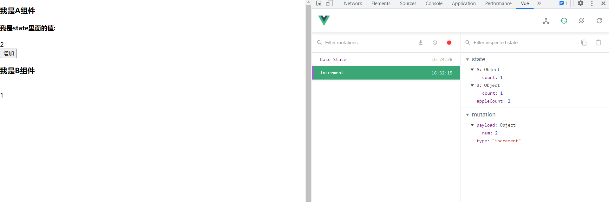

---

title: Vue进阶之与vuex来一次邂逅
date: 2022-01-19
tags:
 - Vue
categories:
 - Vue
---

::: tip 

最是人间留不住，朱辞颜镜花辞树，与vuex来一次完美的邂逅吧!o(**￣︶￣**)o

:::

<!-- more -->

先埋一个伏笔


看不懂不要紧。这张图片只是一个伏笔

## 目录

[[toc]]

## 前奏


学习一个新的知识,应该带有一些目的性,或者了解一下相关背景,带着疑问去学一个东西,至少不会那么痛苦。(不要跟我说学习是快乐的,学习哪来的快乐(￣ー￣) (￣ー￣))

我们先看一个场景,一个很常见且简单的需求。

有2个兄弟组件A,B,现在A,B组件有一个`count`变量需要共享,也就是`count`改变了,两边组件的`count`都要改变,这时候除去我们知道的`vuex`，我们可以怎么做呢

1.使用中央总线`$bus`

2.把count放到A,B组件的父级组件上,然后父子组件传参

3.借用本地存储

思路肯定是没有问题的,问题也能够解决,但是,如果现在的场景是A,B,C三个组件(甚至是三个以上组件)都需要共享同一个变量呢?还用以上2种方法就显得非常麻烦和累赘了。带着这个问题,我们看看应该怎么处理。这时候就有同志问了,那为什么不借用本地存储呢？别急,继续往后看

## 主题

接下来介绍我们的主角:**vuex**

`vuex`官方称为vue的状态管理工具,通俗一点解释,就是一个大仓库,项目中的所有组件都可以向`vuex`这个大仓库拿东西,删东西,改东西。

但是需要遵循一定的游戏规则。并且仓库的东西被动了,会通知到所有的组件:’啊,我的东西被别的组件给修改了‘。所以`vuex`的数据是响应式的。这就是本地存储跟`vuex`很大的一个区别

先上用vue-cli4搭出来的`store`目录下`index.js`文件的脚手架代码,先说一下Vue的原型上是有`$store`属性的,这个可以认为是`vuex`仓库

```js
import Vue from 'vue'
import Vuex from 'vuex'

Vue.use(Vuex)

export default new Vuex.Store({
  state: {
  },
  mutations: {
  },
  actions: {
  },
  modules: {
  }
})

```

我们看到vuex一共有5个模块,我们一一来进行分析

## State

`state`就是我上面所说的大仓库,所有的组件都可以拿到`state`里面的数据,再次强调一下,**state**里面的数据是响应式的。

我们在`state`里面搞一个变量`count`

```js
export default new Vuex.Store({
  state: {
      count: 1
  },
  mutations: {
  },
  actions: {
  },
  modules: {
  }
})
```


讲了这么多,我们开始上A组件的代码

```vue
<template>
  <div class="a-container">  
      <h3>我是A组件</h3>
    {{ $store.state.count }}
  </div>
</template>

<script>
</script>

<style scoped lang="less"></style>

```

在上B组件的代码

```vue
<template>
  <div class="b-container">
    <h3>我是B组件</h3>
    {{ $store.state.count }}
  </div>
</template>

<script>
export default {
  name: 'B',
  data () {
    return {}
  },
}
</script>

<style scoped lang="less"></style>

```

在上视图


很明显,`state`的值我们都拿到了。但是这时候问题又来了,如果一个组件或多个组件都需要使用这个`count`,那么我们在模板页面就要反复使用`$store.state.count`,觉不觉得点的有点麻烦?这时候我们又来了一个新东西,**mapState**辅助函数,这个辅助函数就是用来帮我们简化的我们操作的。

### 1.mapState辅助函数

`mapState`是`vuex`的辅助函数,主要用来帮助我们在开发中简化我们的操作,更方便的取到`state`中的值

#### 1.1mapState辅助函数的数组映射

话不多说,直接上代码

talk is cheap,show you my code

```vue
<template>
  <div class="b-container">
    <h3>我是B组件</h3>
    {{ count }}
  </div>
</template>

<script>
import { mapState } from 'vuex'
export default {
  name: 'B',
  computed: {
    ...mapState(['count'])
  },

}
</script>

<style scoped lang="less"></style>

```

这个地方我暂时还没找到比较好的解释方法,因为我觉得看代码足以能理解`mapState`函数怎么使用了。等我想到通俗易懂的语言来解释此处时,我会在更新文档。

#### 1.2 mapState辅助函数的对象式映射

这一部分你需要先了解`modules对象的相关知识`,如果你还不了解`modules`模块,你等会在来看就比较好了,比如说modules模块有A，B个模块,也就是下面这样

```js
  state: {
    count: 1
  },
  mutations: {},
  actions: {},
  modules: {
    A,
    B
  }
```

那这时候你再用数组的方式把`vuex`的数据映射到当前组件,就肯定不行了,因为当前组件搞不清楚你这个`count`是哪个模块里面的了。

这时候就要用到对象式映射了

上代码

```vue
<template>
  <div class="a-container">
    <h3>我是A组件</h3>
    {{ count }}
  </div>
</template>

<script>
import { mapState } from 'vuex'
export default {
  name: 'A',
  data () {
    return {}
  },
  props: {},
  components: {},
  computed: {
    ...mapState({
        // 拿到state模块中的A分支,在取A分支中的count
      count: (state) => state.A.count
    })
  },
}
</script>

<style scoped lang="less"></style>

```

这一部分我觉得看我代码中的注释完全是能够理解的。

## getters

`getters`属性可以理解为组件里面的计算属性,举个例子,你去水果店买苹果,最后你的总价,肯定是单个苹果的价格乘以苹果的总数量。

这时候就可以给`state`对象里面来2个属性了

```js
export default new Vuex.Store({
  state: {
      // 苹果的数量
    count: 1,
      // 苹果的单价
    applePrice: 5
  },
  mutations: {},
  getters: {

  },
  actions: {},
  modules: {
    A,
    B
  }
})
```

那么苹果的总价`appleSum`就是`count * applePrice`了,这时候苹果的总价格是随着`count`和`applePrice`这2个变量而改变的,所以这个变量我们就可以放在`getters`里面了

```js
  state: {
    count: 1,
    applePrice: 5
  },
  mutations: {},
  getters: {
      // 苹果的总价格,这里箭头函数能接受一个参数,就是state,第二个参数是getters,也就是说你可以用getters里面的其他变量
    appleSum: (state) => {
      return state.count * applePrice
    }
  },
  actions: {},
  modules: {
    A,
    B
  }
```

> 这里引用Vuex官方的一句话getters 的返回值会根据它的依赖被缓存起来，且只有当它的依赖值发生了改变才会被重新计算。

在后面的使用中,在组件中使用`vuex`里面的值或者函数,统一使用函数映射的方式,这是目前项目中的主流方式。

组件使用`getters`中的变量，注意看注释

```vue
<template>
  <div class="a-container">
    <h3>我是A组件</h3>
    <h4>我是state里面的值:</h4>
    {{ count }}
    <h4>我是getters里面的值</h4>
    {{ appleSum }}
  </div>
</template>

<script>
import { mapGetters, mapState } from 'vuex'
export default {
  name: 'A',
  data () {
    return {}
  },
  props: {},
  components: {},
  computed: {
    ...mapState({
      count: (state) => state.A.count
    }),
      // 这种写法你可理解为,把getters中的appleSum映射到当前组件中,并且在当前组件中命名为appleSum
    ...mapGetters(['appleSum'])
      // 如果你想给予其它命名,你可以使用如下写法
      ...mapGetters({
      // key是你自己另外取的名字,value是getters里面的名字
      apple_sum: 'appleSum'
  })
  },
  watch: {},
  created () {},
  mounted () {},
  methods: {}
}
</script>

<style scoped lang="less"></style>

```

上视图


### getters传参

先看场景: 现在你在网上买了**苹果**付款总价应该是**苹果**的个数乘以**苹果**价格。但是现在水果店还有橘子卖。这时候就得根据水果的`id`查出水果的价格,在算。这里我们假设用户只能购买一种水果(别杠,理解为主o(╯□╰)o)

上`state`里面的变量

```js
 state: {
    appleCount: 1,
    orangeCount: 2,
        // 水果信息
    fruitInfo: [
      { id: 1, price: 10 },
      { id: 2, price: 20 }
    ]
  }
```

上`getters`里面的变量

```js
  getters: {
    fruitPrice: (state) => {
      return (id) => {
        const fruit = state.fruitInfo.find((val) => val.id === id).price
        return fruit.price * fruit.count
      }
    }
  },
```

A组件调用:

```vue
<template>
  <div class="a-container">
    <h3>我是A组件</h3>
    <h4>我是state里面的值:</h4>
    {{ count }}
    <h4>我是getters里面的值</h4>
    {{ fruitPrice(2) }}
  </div>
</template>

<script>
import { mapState } from 'vuex'
export default {
  name: 'A',
  data () {
    return {}
  },
  props: {},
  components: {},
  computed: {
    ...mapState({
      count: (state) => state.A.count
    }),
    fruitPrice () {
        // 计算属性传参
      return (id) => {
        return this.$store.getters.fruitPrice(id)
      }
    }
  },
  watch: {},
  created () {},
  mounted () {},
  methods: {}
}
</script>

<style scoped lang="less"></style>

```

上视图


## Mutations

还是先说场景,现在用户在某app购买界面买苹果,点击增加的图标,所购苹果的数量肯定要加1,假设这个苹果的数量我们是存在vuex里面的,那么现在就涉及到vuex里面数据的改变了。

你所有对`vuex`里面的变量进行的修改操作,都必须通过`mutations`这一个对象,`Mutations`你可以理解为仓库的管理员,对仓库里面的材料进行改动,你就要告知他。

我们现在`mutations`对象里面搞一个对苹果数量增加的操作:

```js
  mutations: {
      // 操作函数接收2个参数,一个是state容器,一个是你调这个函数所传的参数,传参有2中方式一种是对象式的传参(官方推荐,变量名称清晰明朗)
    increnment (state, payload) {
      state.appleCount = payload.num + state.appleCount
    }
      // 另一种是单个变量传参
          increnment (state, num) {
      state.appleCount = state.appleCount + num
    }
  }
```

然后在A组件我们调用一下（还是直接用辅助函数的形式去映射,注意看注释）这里我们跳过`this.$store.commit`的方式讲解,因为项目开发这种方式基本不用

```vue
<template>
  <div class="a-container">
    <h3>我是A组件</h3>
    <h4>我是state里面的值:</h4>
    {{ count }}
    <br />
    <button @click="onIncreatment">增加</button>
  </div>
</template>

<script>
import { mapState, mapMutations } from 'vuex'
export default {
  name: 'A',
  data () {
    return {}
  },
  props: {},
  components: {},
  computed: {
    ...mapState({
      count: (state) => state.appleCount
    })
  },
  watch: {},
  created () {},
  mounted () {},
  methods: {
    // 注意这个辅助函数要放在methods里面
    ...mapMutations(['increment']),
      // 如果你想修改映射过来的函数名称,你可以用对象式写法
      ...mapMutations({
          incre: 'increment'
      }),
    onIncreatment () {
      this.increment({
        num: 2
      })
    }
  }
}
</script>

<style scoped lang="less"></style>

```

视图更新前


点击增加按钮后



视图更新,并且调试工具记录下来了这么一个改变的过程。

### 关于使用mutations的小细节

* 所有的异步操作,不要放在`mutations`里面,也就是说`mutations`里面只能放同步操作。

  这里要解释一下,你在mutations里面放异步操作不是说代码会无效,而是调试工具它会监测不到数据的改变,假设别人接收你的项目,然后用调试工具调试,那么麻烦就大了。

* 可以使用常量来代理事件类型,也就是说,你的所有`mutations`的命名可以封装起来,这里我项目中暂时还没用到,等实际用到我会在此补充先贴一个[官方解释](https://vuex.vuejs.org/zh/guide/mutations.html#%E4%BD%BF%E7%94%A8%E5%B8%B8%E9%87%8F%E6%9B%BF%E4%BB%A3-mutation-%E4%BA%8B%E4%BB%B6%E7%B1%BB%E5%9E%8B)

## Actions

如果你有异步操作,比如请求后端接口,那么你可以选择放在`actions`模块里面。

场景: 用户登录,登录成功,保存用户数据,登录失败,给予用户提示

  actions模块里面的函数也能接受2个参数,第一个是上下文context,官方说跟store是有区别的,关于context和store的区别,我理解之后再更新文档,这里附上context对象


`actions`代码:

```js
 actions: {
     /**
     login为已经封装好的登录方法,这里假设用户登录失败后端直接返回错误的状态码
      **/
    onLogin (context, data) {
      return new Promise((resolve, reject) => {
        login(data)
          .then(res => {
            context.commit('setUser', res)
            resolve()
          })
          .catch(err => {
            reject(err)
          })
      })
    },
        // 如果你经常需要用到commit,你可以直接在接受的时候解构
            onLogin ({ commit }, data) {
      return new Promise((resolve, reject) => {
        login(data)
          .then(res => {
            // 登录成功把数据存到vuex
            context.commit('setUser', res)
            resolve()
          })
          // 登录失败把错误丢出去
          .catch(err => {
            reject(err)
          })
      })
    }
  },
```

A组件代码,我们还是用辅助函数把`actions`里面的函数映射到A组件

```vue
<template>
  <div class="login-container">
	<div>
       <button>
           登录
    </button>
    </div>
  </div>
</template>

<script>
import { mapActions } from 'vuex'

export default {
  name: 'Login',
  data () {
    return {

      //  后端返回的用户信息
      userInfo: null,

    }
  },
  methods: {
    ...mapMutations(['setUser']),
    ...mapActions(['onLogin']),
    },
    // 表单校验成功登录操作
    async login () {
      try {
        await this.onLogin(this.loginForm)
        this.$message.success('登录成功')
          // 登录成功跳转首页
        this.$router.push('/layout/home')
        this.isLogin = false
      } catch (error) {
        const { response } = error
        if (response && response.status === 400) {
          this.$message.error('手机号或验证码不对')
        } else if (response && response.status === 403) {
          this.$message.error('权限不足无法登录')
        } else if (response && response.status === 507) {
          this.$message.error('数据异常')
        } else {
          // 处理其他异常
        }
      }
    },
}
</script>

<style lang="less" scoped>

</style>

```

### 组合Action

场景: 有时候会有这种需求,先根据用户名获取用户`id`（假设这个用户`id`是好几个组件共享的),在根据用户`id`去查找用户相关信息,这时候异步操作就是有顺序的了

上代码:

```js
    async onGetUserId ({ commit }, userName) {
      const id = await getUserId(userName)
      commit('setUserId', {
        id
      })
    },
    async onGetUserInfo ({ commit, dispatch, state }, userName) {
        // 先等onGetUserId方法完成
      await dispatch('onGetUserId', userName)
      const userInfo = await getUserInfo(state.userId)
      commit('setUserInfo', userInfo)
    }
```

## 关于伏笔的解释

写到这里,文章最开始的伏笔就起到作用了

这里再次把文章最开始的图片贴出来


我们从`Vue Components`开始,假设我们要修改vuex里面的值,如果没有异步操作,那么就通过commit的方式提交给`mutations`,`devtools`vuex调试工具这时候会监测到该次修改,然后`state`里面的值发现改变,相关的组件变量重新渲染,视图得以更新。

如果有异步操作,我们先进行异步操作,根据后端接口返回的不同状态,决定`commit`到哪个方法

## Modules

还是先说场景,比如我们现在多人协作开发一个商城项目,商城有首页,登录页,商品详情页,搜索页,如果把所有页面需要共享的数据全放在`vuex`的`state`里面,可以当然是可以,但是容器就变得比较臃肿了,这时候我们就可以进行模块化的区分了,也就是可以把首页的相关组件主要共享的变量拆出来,搜索页需要共享的组件拆出来。这样整个容易的结构就很清晰了,也利于维护。

上目录结构:

store

​	modules

​		--home.js

​		--search.js

上`home`和`search`页的代码

`home.js`

```js
export default {
  state: {
    count: 1
  },
  mutations: {},
  actions: {}
}

```

`search.js`

```js
export default {
  state: {
    count: 2
  },
  mutations: {},
  actions: {}
}

```

模块要在`index.js`文件也就是要在`vuex modules`中注册

```js
import Vue from 'vue'
import Vuex from 'vuex'
import A from './a'
import B from './b'
Vue.use(Vuex)

export default new Vuex.Store({
  state: {
      count: 3
  },
  mutations: {
  },
  getters: {},
  actions: {
  },
  modules: {
    A,
    B
  }
})

```

### 命名空间

在怎么取相关模块的值之前,先说一个命名空间

先引用官方原话

> 默认情况下，模块内部的 action、mutation 和 getter 是注册在**全局命名空间**的——这样使得多个模块能够对同一 mutation 或 action 作出响应。

也就是说,你在`home.js`和`search.js`里面写的`action`、`mutation` 和`getter`，它自动被放到了`index.js`文件下的`action`、`mutation` 和`getter`里面,解决这一问题,我们可以按照如下方式做,话不多说上代码

`home.js`

```js
export default {
    // 加一个 namespaced: true属性
  namespaced: true,
  state: {
    count: 1
  },
  getters: {
    gettersCount (state) {
      return ++state.count
    }
  },
  mutations: {},
  actions: {}
}

```

A组件代码(注意看注释)

先上A组件代码

```vue
<template>
  <div class="a-container">
    <h3>我是A组件</h3>
    <h4>我是A模块里面的gettersCount值:</h4>
    {{ gettersCount }}
    <br />
  </div>
</template>

<script>
import { mapGetters } from 'vuex'
export default {
  name: 'A',
  data () {
    return {}
  },
  props: {},
  components: {},
  computed: {
    // ...mapState({
    //   count: (state) => state.count
    // })
      // 第一个参数是模块名,第二个是你要映射的模块getters变量,你也可以用对象时映射,如果你觉得变量名称需要改变
    ...mapGetters('A', ['gettersCount'])
  },
  watch: {},
  created () {
    console.log(this.$store)
  },
  mounted () {}
}
</script>

<style scoped lang="less"></style>

```

上视图


这样就拿到A模块里面的getters了。action和mutation同理，在methods里面映射一下就行了

```js
  methods: {
    ...mapMutations('A', ['mutationsTest']),
    ...mapActions('A', ['actionTest'])
  }
```

### 提示

别忘记加上`namespaced: true`这一条属性哦~

待补充。。。。。。。
