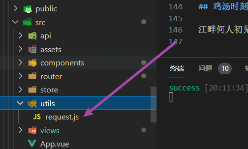

## 前言

本文章默认你已经了解过`axios`,如果你还不了解什么是`axios`,不建议看这篇文章

## 主题

先npm安装依赖

```npm
npm install axios -S
```

新建resquest.js文件,如下图所示。



上request.js代码

```js
import axios from 'axios'
import { Message } from 'element-ui'
// request是一个axios实例,每一个实例你都可以单独定制它的baseurl,超时时间和一些其他配置项。
const request = axios.create({
  baseURL: '/api',
  timeout: '5000'
  // transformResponse: [function (data) {
  //   try {
  //     console.log(jsonBig.parse(data))
  //     // 如果转换成功则返回转换的数据结果
  //     return jsonBig.parse(data)
  //   } catch (err) {
  //     // 如果转换失败，则包装为统一数据格式并返回
  //     return data
  //   }
  // }]
})
// 请求拦截器
request.interceptors.request.use(
  (config) => {

    return config
  },
  (error) => {
    return Promise.reject(error)
  }
)
// 响应拦截器
request.interceptors.response.use(
  (config) => {

    return config
  },
  (error) => {
    if (error.message === 'timeout of 5000ms exceeded') {
      Message.error('服务器忙,请稍后再试!')
    }
    return Promise.reject(error)
  }
)
export { request }

```

假设我们在开发登录页,并且在接登录页的接口。我们就可以这么封装方法。

```js
import axios from 'axios'
// 登录
export const login = (data) => {
  return request({
    method: 'POST',
    url: '/login',
    data
  })
}
```

配置代理一般的来说,开发阶段是要配置代理的,因为存在跨域问题。vue.config.js文件写入如下配置

```js
  devServer: {
    open: true,
    port: 8080,
    https: false,
    proxy: {
      '/api': {
        target: '后端给你的baseurl地址',
        changeOrigin: true,
        ws: false
      },
    }
  },
```

## 环境变量

开发环境和生产环境一般是2套url,也就是接口地址(baserurl)是不一样的。这个时候就要配环境变量了。新建2个文件夹,一个`env.development`文件,一个`.env.production`文件。
