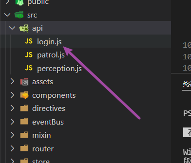
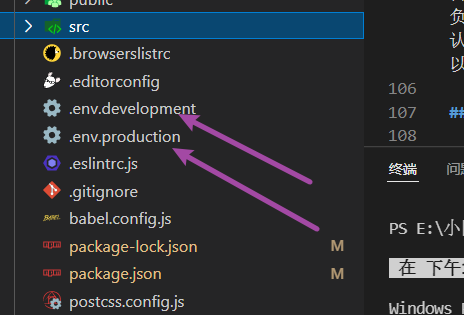

## 前言

本文章默认你已经了解过`axios`,如果你还不了解什么是`axios`,不建议看这篇文章

## 主题

先npm安装依赖

```npm
npm install axios -S
```

新建resquest.js文件,如下图所示。


上request.js代码

```js
import axios from 'axios'
// request是一个axios实例,每一个实例你都可以单独定制它的baseURL,超时时间和一些其他配置项。
const request = axios.create({
  baseURL: '/api',
  timeout: '5000'
})
// 请求拦截器,就是说请求在到达服务器之前,你对发送到服务器的数据进行一些处理,比如
// 后端说除了登录之外的接口都要在请求头上面带上token,你就可以在这里处理
request.interceptors.request.use(
  (config) => {
    return config
  },
  (error) => {
    return Promise.reject(error)
  }
)
// 响应拦截器,后端数据真正被你的变量接收之前,进行一些预处理,比如对于一些5,4开头的状态码进行统一处理
request.interceptors.response.use(
  (config) => {

    return config
  },
  (error) => {
    return Promise.reject(error)
  }
)
export { request }

```

假设我们在开发登录页,并且在接登录页的接口。我们就可以这么封装方法。



`login.js`文件写入如下代码

```js
import { request } from 'utils/request'
// 登录
export const login = (data) => {
  return request({
    method: 'POST',
    url: '/login',
    data
  })
}
```

`login.vue`组件使用

```js
// 导入方法
import { login } from 'api/login'
export default {
  data () {
    return {
      loginForm: {
        username: '',
        password: '',
      },

    }
  },
  methods: {
    async onLogin () {
   		const res = await login(this.loginForm)
    },
  }
```


## 配置代理

一般的来说,开发阶段是要配置代理的,因为存在跨域问题。vue.config.js文件写入如下配置,这个地方的意思就是,只要是你的请求路径上有`/api`，比如你访问地址为`http://localhost:8080/api/xxx`，那么实际上的请求地址为`后端给你的baseurl地址/xxx`,如果`/api`你想保留,`pathRewrite`属性你就选择不要

```js
  devServer: {
    open: true,
    port: 8080,
    https: false,
    proxy: {
      '/api': {
        target: '后端给你的baseurl地址',
        changeOrigin: true,
        ws: false,
        pathRewrite: {
          '^/api': ''
        }
      },
    }
  },
```

## 环境变量

开发环境和生产环境一般是2套url,开发环境一般不会给你线上地址去调式的也就是接口地址(baserurl)是不一样的。这个时候就要配环境变量了。新建2个文件,一个`env.development`文件,一个`.env.production`文件。结构如下



`.env.development`文件写入如下内容

```js
NODE_ENV = 'development'
VUE_APP_MODE = 'development'
VUE_APP_BASE_URL = "这个一般是/api"
```

.`env.production`写入如下内容

```js
NODE_ENV = 'production'
VUE_APP_MODE = 'production'
VUE_APP_BASE_URL = "这个一般要跟你们后端约定"
```

把`request.js`文件的`baseURL`修改一下,这样开发阶段就是`baseURL`就是`env.development`下`VUE_APP_BASE_URL`的值,这样部署上线阶段就是`baseURL`就是`env.production`下`VUE_APP_BASE_URL`的值,

```js
const request = axios.create({
  baseURL: process.env.VUE_APP_BASE_URL,
  timeout: '5000'
})
```

## 博客

欢迎访问我的博客[www.smartxy.cc](http://www.smartxy.cc/)
