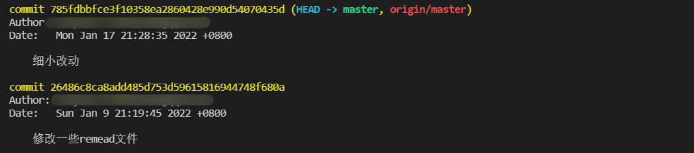
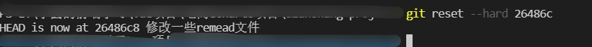
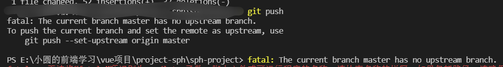
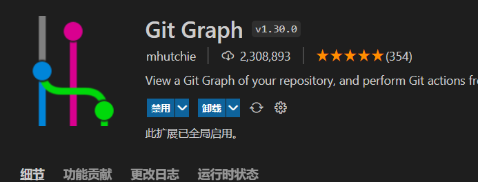

::: tip 

这是一篇关于git常用命令的文档o(￣▽￣)ｄ

:::


<!-- more -->

### 提交暂存区

```
git add .
```

### 提交本地仓库

```
git commit -m '该次提交的一些提示信息'
```

### 关联远程仓库

```
// 注意这个origin只是你的远程仓库别名,你也可以取其他的名字,不过一般都是用origin
git remote add origin '远程仓库名字' 
```

### 推送到远程仓库,第一次推送要写远程分支的名字,推送成功后,后面直接git push就行了

```
git push origin master
```

### 查看远程仓库地址

```
git remote -v
```

### 撤销本次git add .

```
git reset head
```

### 撤销本次git commit不撤销add

```git
git reset --soft HEAD^
```

### git 移除

```
git remote rm 远程仓库名(一般是origin)
```

### git 创建分支

```
// 第一次创建新的分支要加-b,比如你现在写一个登录页,那么你可以这样
git checkout -b login
// 这样相当于新建了一个login分支,并切换到了login分支
第二次直接 git checkout login就行了
```

### git 查看当前分支

```
git branch
```

### git 查看历史提交记录

```
// 注意输入git log 后,退出当前终端,输入wq就行了,这是linux命令,不然你输别的东西退不出终端的
git log

```

### git 克隆项目

```
// 这里克隆项目一般都用ssh地址,克隆ssh地址报错,排查一段时间后还是解决不了,就用https地址
git clone 远程仓库地址
```

### git查看距离上一次提交到目前你做过的改动

```git
git status
// 这个是查看简要的改动信息
git status -s
```

### git合并分支

比如我们现在有2个分支,一个`master`主分支,一个`login`页的分支,在合并分支之前我们最好先用`git branch`看一下我们处于哪个分支,假设我们在`login`分支,先把`login`分支推上去

```git
git add .
git commit -m 'login submit'
// 远程上没有login分支会自动创建一个
git push origin login
```

然后`git checkout master`切换到主分支

```
// 把login分支跟master分支合并
git merge login
// 注意合并了之后不用在提交本地仓库了,直接就可以推上去
git push origin master
```

### git查看操作日志

```git
git reflog
```

### git 回到指定版本

1.先git log 查看历史记录



2.根据你曾经的commit -m ‘你的提交信息去’ 回退版本

比如我现在要回退到**细小改动**这个版本

命令行输入

```
// 你输入git log 后 退出命令行要在输入wq
// 然后--hard后面接的是你的版本号 也就是黄色的commmit那一行,输入前5位就可以了
git reset --hard 785fd  
```

3.输入回退命令后可以看到相关提示信息



### 下班之前你需要做的事情

```
git add .
git commit -m '搞定了'
git push 
下班
```

## 遇到的一些问题

有时候二次git push会出现以下问题



这个时候按提示输入`git push --set-upstream origin 远程分支名字 `关联一下,以后再输入git push就不会报错了

待补充。。。。。。。。

### vscode插件推荐

推荐一款我个人觉得很好用的`git`插件



## 结束语

git命令输完后,没有消息就是好消息(～￣▽￣)～
