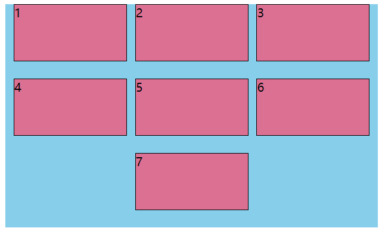
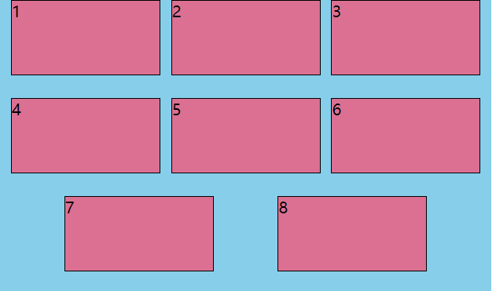
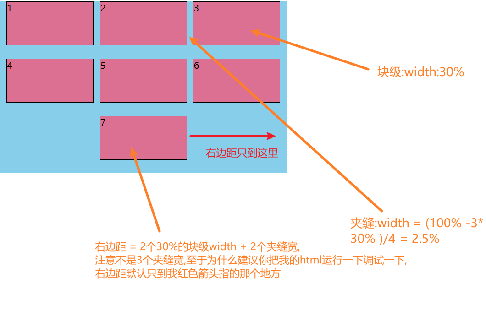

## 问题描述

使用 `justify-content: space-evenly;`布局,最后一行元素没撑满会出现元素不会在起始位置分布的问题

问题图





### html

```html
<!DOCTYPE html>
<html lang="en">

<head>
  <meta charset="UTF-8">
  <meta http-equiv="X-UA-Compatible" content="IE=edge">
  <meta name="viewport" content="width=device-width, initial-scale=1.0">
  <title>Document</title>
  <style>
    .parent {
      width: 500px;
      height: 300px;
      background: skyblue;
      justify-content: space-evenly;
      display: flex;
      flex-wrap: wrap;
      overflow: auto;
    }

    .parent .child {
      width: 30%;
      height: 25%;
      background-color: palevioletred;
      border: 1px solid black;
    }

    /* .parent .child:last-child:nth-child(3n-2) {
      margin-right: calc(60% + (10% / 4) * 2);
    }

    .parent .child:last-child:nth-child(3n-1) {
      margin-right: calc(30% + (10% / 4) * 1);
    } */
  </style>
</head>

<body>
  <div class="parent">
    <div class="child">1</div>
    <div class="child">2</div>
    <div class="child">3</div>
    <div class="child">4</div>
    <div class="child">5</div>
    <div class="child">6</div>
    <div class="child">7</div>
    <!-- <div class="child">8</div> -->
  </div>
</body>

</html>
```

## 解决方案

给最后一个元素加右边距



这时候要判断,最后一排是有2个元素还是只有1个元素。判断直接用`css`给子元素选择器就行了。

完整参考`html`

```html
<!DOCTYPE html>
<html lang="en">

<head>
  <meta charset="UTF-8">
  <meta http-equiv="X-UA-Compatible" content="IE=edge">
  <meta name="viewport" content="width=device-width, initial-scale=1.0">
  <title>Document</title>
  <style>
    .parent {
      width: 500px;
      height: 300px;
      background: skyblue;
      justify-content: space-evenly;
      display: flex;
      flex-wrap: wrap;
      overflow: auto;
    }

    .parent .child {
      width: 30%;
      height: 25%;
      background-color: palevioletred;
      border: 1px solid black;
    }

    .parent .child:last-child:nth-child(3n-2) {
      margin-right: calc(60% + (10% / 4) * 2);
    }

    .parent .child:last-child:nth-child(3n-1) {
      margin-right: calc(30% + (10% / 4) * 1);
    }
  </style>
</head>

<body>
  <div class="parent">
    <div class="child">1</div>
    <div class="child">2</div>
    <div class="child">3</div>
    <div class="child">4</div>
    <div class="child">5</div>
    <div class="child">6</div>
    <div class="child">7</div>
    <!-- <div class="child">8</div> -->
  </div>
</body>

</html>
```

