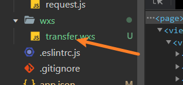
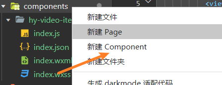
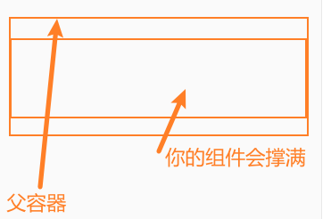

## 使用wxs代码来实现vue中过滤器效果

在`vue`中对展示的数据进行统一处理,我们可以在组件中自己写一个过滤器,来转化数据,但是在小程序中是没有`filter`这个属性的,比如以下的`wxml`文件

```html
<view class="single-video">
          <view class="album">
              <text>{{duration}}</text>
            </view>
          </view>
          <view class="content">
          </view>
        </view>
```

现在假设`duration`是后端返回的持续时间,以毫秒为单位。但是在小程序页面里面我们要转化为秒。并且秒数是1位数的时候还要左边补0.(`duration`你可以理解为一首歌的播放时间)

这时候就可以考虑使用`wxs`代码了。



`wxs`里面的内容跟你写`js`是一样的,这个`wxs`文件给我的理解就是,你可以在里面封装一些自己的函数和变量,然后导出去给别的模块使用。

上`wxs`代码,**但是要记住wxs里面的语法不能使用ES6的！！！**

上`wxs`代码

```js
// 左边补0
function addLeftZero(value) {
  value = value.toString();
  var length = value;
  if (length === 0) {
    return "00";
  } else if (length === 1) {
    return "0" + value;
  } else {
    return value;
  }
}
// 处理播放时间
function transferPlayTime(value) {
  // 换算成秒
  var allSeconds = parseInt(value) / 1000;
  // 多少分钟
  var minute = parseInt(allSeconds / 60);
  // 多少秒
  var second = allSeconds % 60;
  return addLeftZero(minute) + ":" + addLeftZero(second);
}
module.exports = {
    // 左边是key,右边是value
  transferPlayTime: transferPlayTime,
};

```

这里封装了2个函数,一个左边补0的函数,一个处理`duration`播放时长的函数。然后把这2个函数导出去,因为不能使用ES6的语法,所以用`common.js`规范去导出。

### 引入

写好了之后就可以把暴露的这2个函数引入到别的`wxml`文件中了

在你要引入的`wxml`文件中放置如下标签,`src`是你的`wxs`文件路径,`model`相当于给你暴露的对象起个名字

```html
<wxs src="../../wxs/transfer.wxs" module="transfer" />
```

**注意这个不要用双标签的方式引入,这里我踩了个坑**

### 使用

我们不是暴露了` transferPlayTime`吗,引入进来之后我们就可以直接在{{}}中使用这个函数了

示例

```html
             <text>{{transfer.transferPlayTime(duration)}}</text>
```

这样`item.duration`就被我们用函数过滤了,实现了类似`filter`的效果

## wxss的一些发现

我发现每个页面和组件的`wxss`是相互独立的(至少目前我在不同模块给相同的类名添加不同的属性,他们的样式没有冲突),也就是直接给相关类名加样式就行了,不需要像`less`,`sass`那样,搞嵌套选择

## 组件的使用

在小程序中也是可以封装自己的组件的,而且跟`vue`非常像，我喜欢把自己的组件放在`components`目录下面



组件写好了,也是要注册的,记得在你的`app.json`文件中注册组件,这样注册的组件时全局组件,如果你想注册为局部的,就在你要引入的那个页面`json`中配置一样的属性就行了

```json
  "usingComponents": {
    "你的组件名": ".你的组件路径"
  }
```

### 组件的踩坑

引入组件后,我在调试的时候发现,每个组件相当于一个单独的`view`块,也就是组件的宽度会撑满一行,这样你的样式就会出很多意想不到的问题,因为你的组件会撑满父容器,所以在组件外层套一个`view`标签,你想要你的组件有多宽,你给`view`标签去设置就行了。



