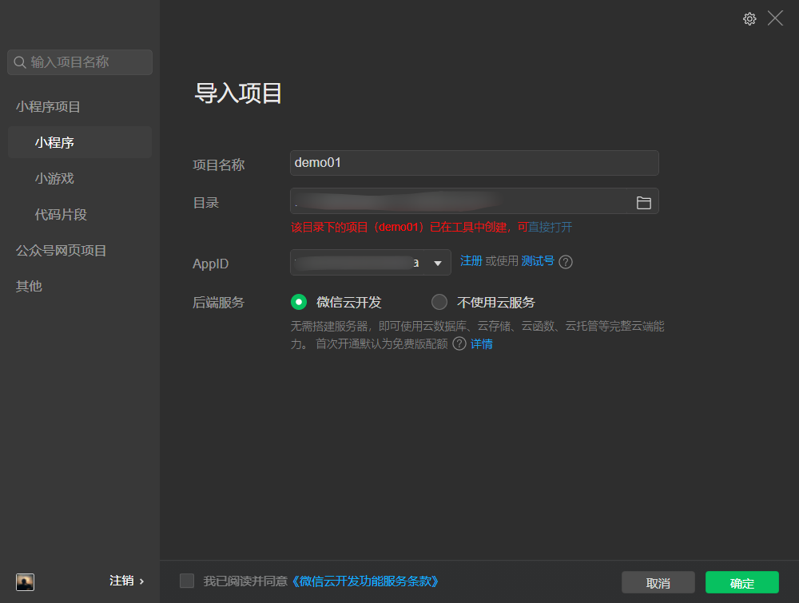
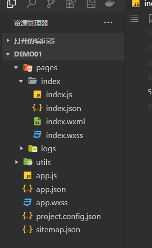
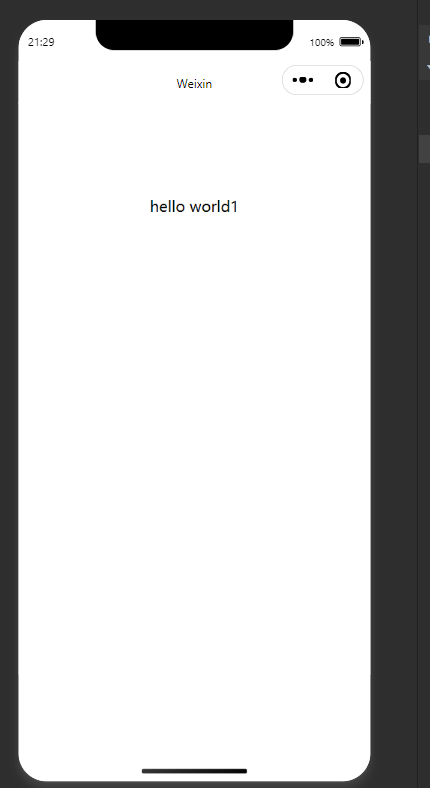
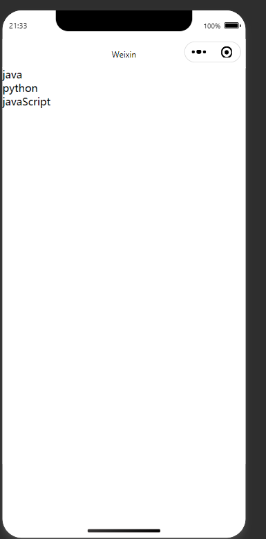

---

title: 小程序学习之路一-初识小程序
date: 2022-02-09
tags:
 - miniProgram
categories:
 - miniProgram
---
## 注册账号

1.先去[微信公众平台](https://mp.weixin.qq.com/)注册账号

2.下载微信开发者工具

3.打开微信开发者工具微信扫描二维码登录,登录后新建一个项目。我这里选的是不使用云服务,云服务类似于免费给你提供服务器,也就是后台。然后输入你的appId。



## 目录结构



一个页面,一个文件夹,就index文件夹来说

* js文件是处理你的逻辑的
* wxml文件类似于你的html文件
* wxcss文件类似于你的css文件
* json文件是配置文件(**这个待补充还没学到**)

## Hello World

`index.wxml`代码

```wxml
<!--index.wxml-->
<view class="container">
{{ message }}
</view>
```

`index.js`代码

```js
Page({
  data: {
    message: 'hello world1'
  }
})
```

这样一个`Hello world`就出来了



## 列表循环

`index.js`代码

```js
Page({
  data: {
    books: ['java', 'python', 'javaScript']
  }
})
```

`index.wxml`

```html
<block wx:for="{{books}}" wx:key="*this">
<view>{{ item }}</view>
</block>
```

`*this`指这个item项,item就是数组的每一项

结果:



## 总结

还好学过`vue`,直接上手小程序感觉一脸懵逼啊。

* 列表循环也是要绑定key的。
* wx:for就是vue的v-for,*this是指item,item就是数组的每一项
* block我理解为vue的template节点,因为它不会生成额外节点