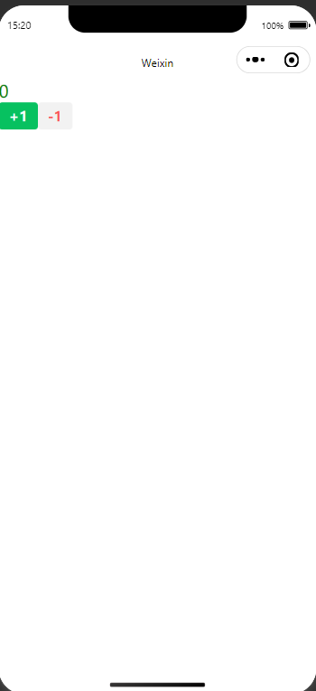

## 绑定事件

给组件绑定点击事件

`index.wxml`代码

```html
<!-- index.wxml -->
<view class="title">{{counter}}</view>
<button bindtap="onIncreament" size="mini" type="primary">+1</button>
<button bindtap="onDecreament" size="mini" type="warn">-1</button>
```

学到这里,得注意一下,在小程序开发中,我个人认为,所有的标签,都应该视为组件,而不能认为是普通的`html标签`。

`index.js`代码

```js
Page({
  data: {
    books: ['java', 'python', 'javaScript'],
    counter: 0
  },
  onIncreament: function () {
    console.log(111)
    this.setData({
      counter: ++this.data.counter
    })
  },
  onDecreament () {
    console.log(this)
    this.setData({
      counter: --this.data.counter
    })
  }
})
```

视图:



## 总结

我发现在用`ES6`函数简写的方式也是行的通的。其它的没有什么注意的