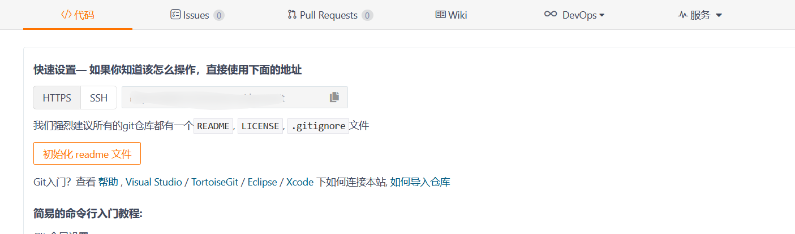
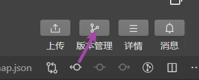
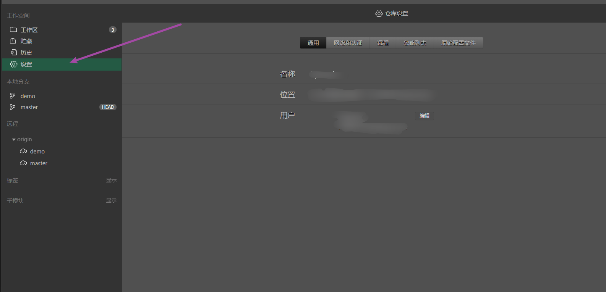
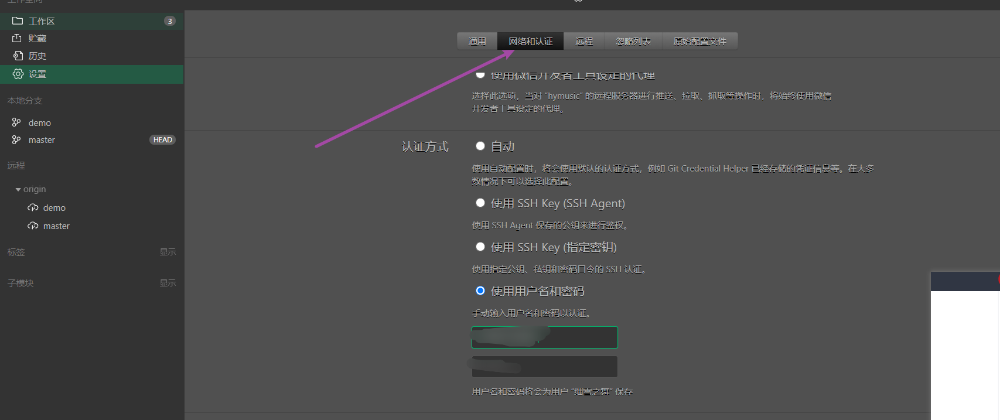
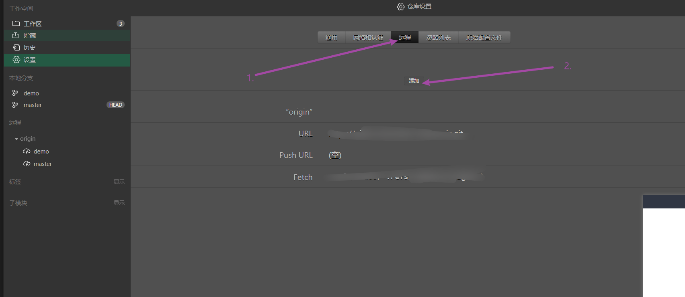
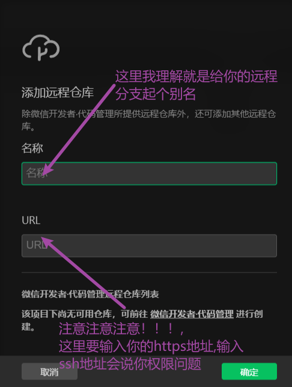
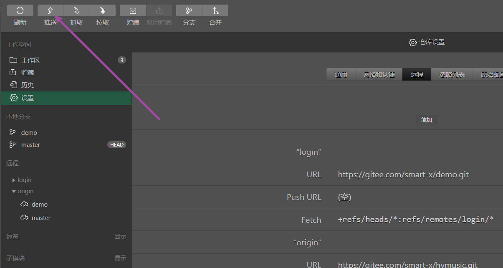
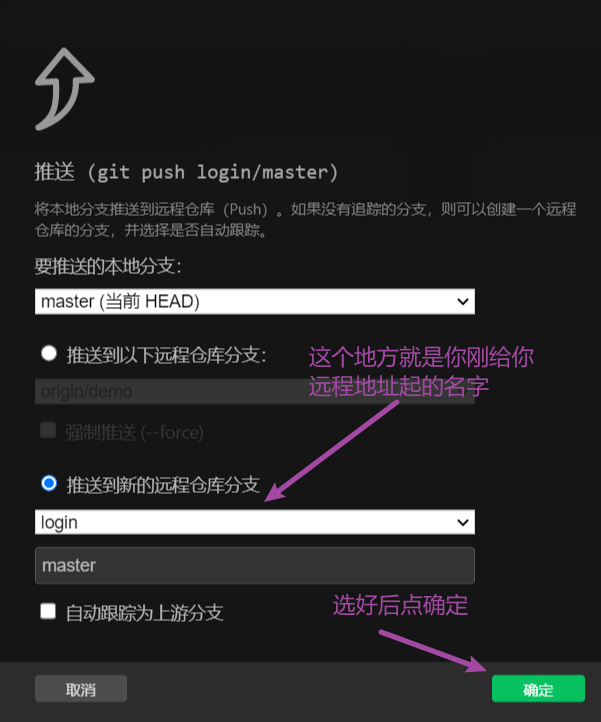
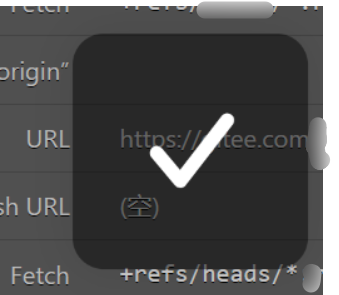
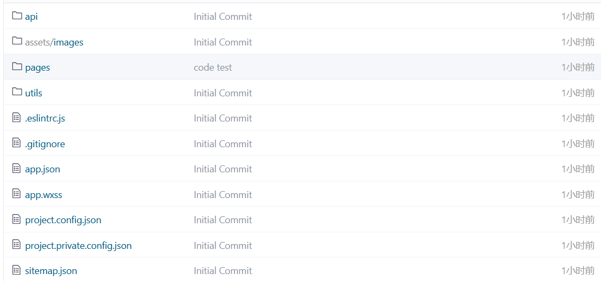

## 微信开发者工具关联gitee远程仓库

###  1.gitee上新建仓库

新建成功后这个会出现这个界面,不要关了

### 2.微信开发者工具上关联

打开微信开发者工具,点击**右上角**版本管理

点击**设置**

点网络和认证,然后点下方使用用户名和密码,输入你的`gitee`账号和密码

再点远程，再点添加

按提示输入名字,和远程分支地址,这个地方要注意去复制你的HTTPS地址

点确定弹窗结束

### 3.测试是否成功

点左上角推送

出现对钩,推送成功

### 4.gitee上面检查一下

去你的仓库看一下是不是推上去了

成功！！！！！

## 博客

欢迎访问我的博客[www.smartxy.cc](http://www.smartxy.cc/)