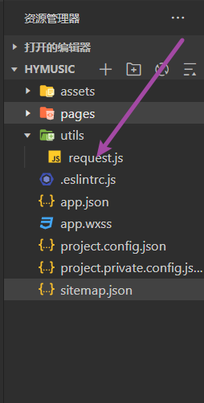
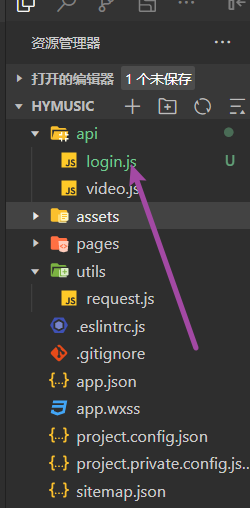

## 我是如何在小程序中封装网络请求的

## 方法一

### 新建request.js文件

新建`request.js`文件,如图所示



上`request.js`代码

```js


// 基准地址
const BASE_URL = '后端给你的baseurl'
/**
 request函数传参格式,要传个对象
 {
   url:'接口地址',
   method: '请求方式',
   data: 请求参数
 }
 */
// 这里用promise进行了一层包装,这样就可以拿到res的值
const request = ({ url, method, data }) => {
  return new Promise((resolve, reject) => {
    wx.request({
      url: `${BASE_URL}${url}`,
      method,
      data,
      success: res => {
        resolve(res)
      },
      fail: err => {
        reject(err)
      }
    })
  })
}
export default request
```

### 新建login.js文件

假设在开发登录页,我们在做登录的功能,新建`api`文件夹,`api`文件夹下新建`login.js`



上`login.js`代码

```js
import request from '../utils/request'
// 登录
export const login = (data) => {
  return request({
    url: '/top/mv',
    method: 'get',
    data
  })
}
```

### login页面使用示例

```js
// 导入loign方法
import { login } from '../../api/video'
Page({

  /**
   * 页面的初始数据
   */
  data: {

  },
    // 用户点击按钮,
  async onLogin () {
    const res = await login(this.data.loginForm)
  }
})
```

