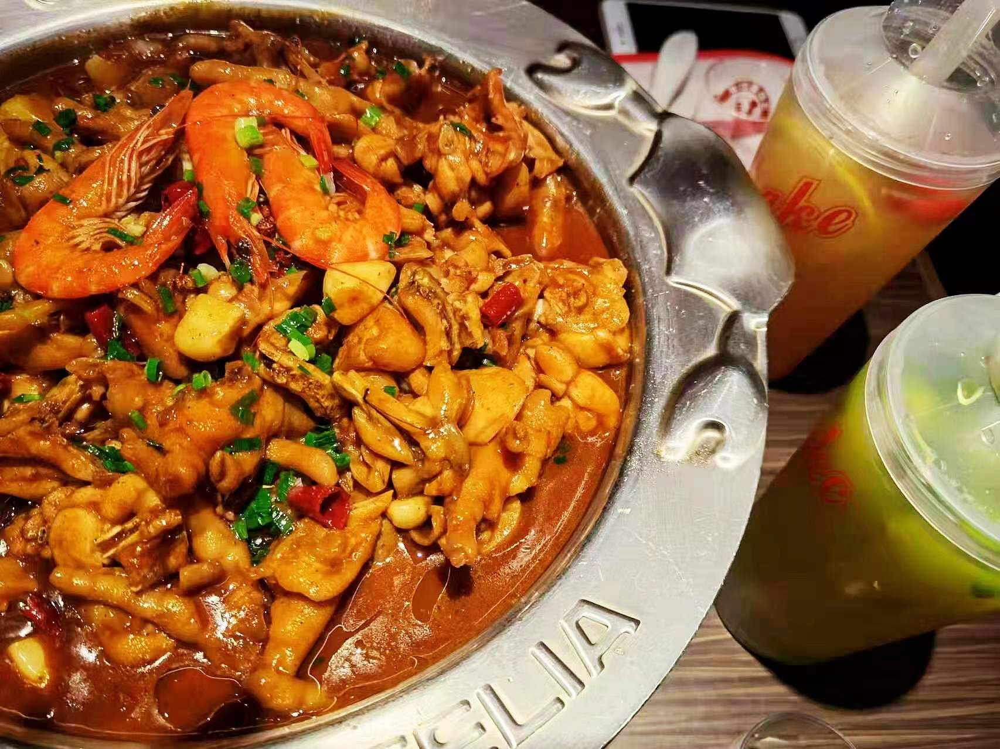
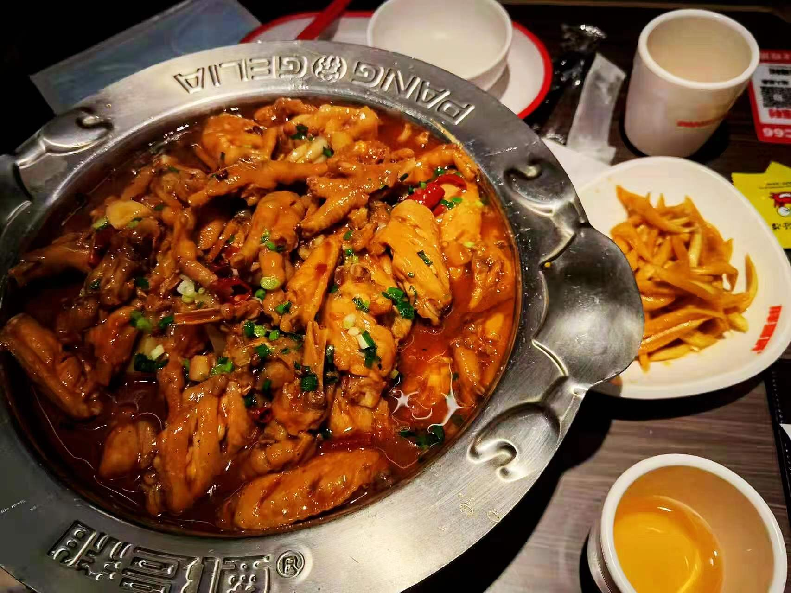
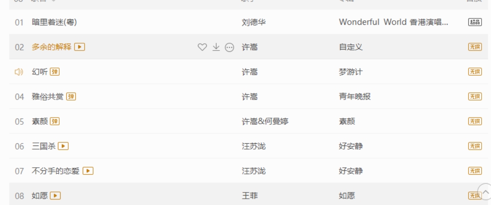
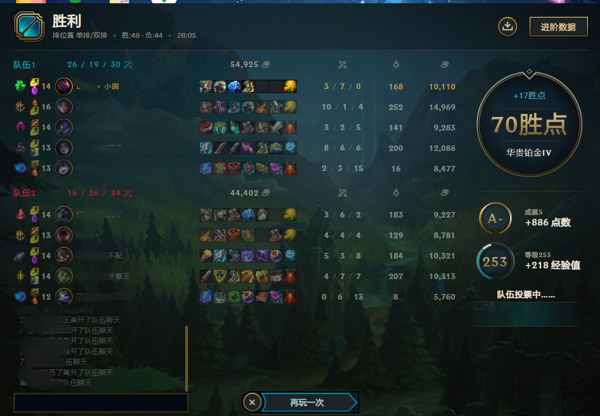

::: tip 
赏脸看看作者的个人简介把(￣︶￣)>
:::

<!-- more -->

## 个人经历与简介

我是一个不知名的小前端,被迫爱上编程,但的确是热爱分享与生活。毕业于杭州,目前在杭州从事前端开发工作。我姓夏,但我不叫夏鸣予,夏鸣予只是我的笔名,你可以叫我夏先生。

大学期间没掌握什么特殊的技能,但精通LOL和DOTA卸载与安装,转眼已经毕业2年多了,回忆起以前的青春,有开心,也有不开心。有过奋斗的日子,也有过颓废的时光。也曾在失望中追求过偶尔的满足，也有很多遗憾。但从未对生活失去过信心。一次偶然的机会,我接触到了Html,Css,JavaScript,当时学三剑客学了差不多20来天,我就去b站看coderwhy老师的Vue视频,然后踏上了我的前端之路。又是一次偶然的机会,我接触到了[VuePress](https://vuepress.vuejs.org/zh/),并且了解到它能快速搭建出我的博客,于是,我的博客便应运而生。

但学编程的道路并不是一帆风顺的,当时学到vue-router的时候,了解到,还需要学习npm,还需要学习一些node的相关知识,还需要学习webpack,当时都是第一次接触,觉得什么都不懂,东西又多,想放弃了。庆幸的是,自己一点点摸爬滚打,坚持的走了过来。

人生可能会有太多遗憾,也有很多不顺心的事情。以前的我经常在想,如果我本科学的是计算机专业,会不会与JavaScript早点相识,庆幸的是,兜兜转转,我最后还是跟JS碰到了,这大概就是缘分吧。现在留下的遗憾,可能就是以后成功路上的铺垫。就连我自己都没想到,我会成为一名程序员,既然选择了这条路,那就坚持走下去吧。始终相信,彼方尚有荣光在,少年不惧岁月长。加油,打工人!

## 爱好

吃: 我认为美食是能起到很大的治愈作用的,所以心情不好的时候,一定要去好吃的。我喜欢吃胖哥俩肉蟹煲(这里真不是打广告),尤其是牛蛙煲,简直是永远滴神！看下面的照片,是不是感觉还不错︿(￣︶￣)︿

最近在金沙天街又发现了一家很不错的烤鱼店,江边城外,我的生活又多了一份选择,真香呐。<(￣︶￣)

歌: 平时听歌,作为一名90后,俺的青春是三巨头(许嵩,徐良,汪苏泷),所以我比较喜欢听他们3个的歌,其中素颜真是我的最爱,哈哈哈。不过最近一直在单曲循环王菲的<<如愿>>,感觉很不错

玩: 游戏现在偶尔还是会玩一下LOL,排位偶尔还是会打一打,只玩男刀和黄鸡了。打上单的话只会混分巨兽。一个郊区白金仔路过︿(￣︶￣)︿,最近迷上了中单送死流老司机,快乐的不行。

逛: 除了**湖滨银泰**能让我有逛一天的欲望之外,好像没发现有什么地方能我很喜欢去待。如果你在杭州工作或者上学的话,推荐你去**湖滨银泰**逛一逛,我觉得那里无论地上还是地下。都是很值得去看一看的。听说8点半还有音乐喷泉,不过我没见过。不知道我有生之年能不能看到一次。

  怎么样,是不是很漂亮。

## 联系方式

如果您对前端也很感兴趣的话,我们可以加个好友,一起交流哦~

## 结束语

我最后的祝福是要给那些人:他(她)们知道我是一个不完美的人,却还依旧爱和支持着我。
以此句话作为我个人简介的结尾: 祝愿那些善良的男孩和女孩,都能拥有一个幸福的人生